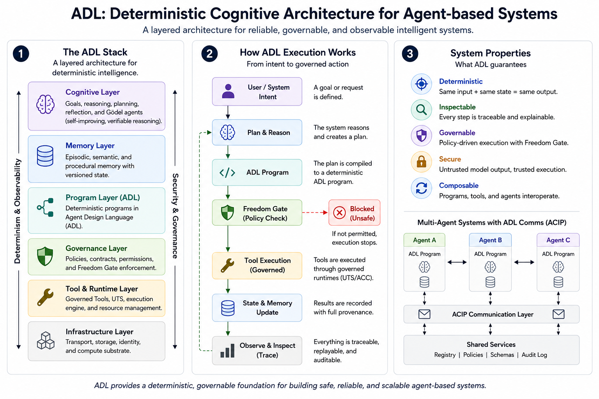

# Agent Design Language (ADL)

Agent Design Language is a deterministic cognitive architecture for building
agent-based systems that are reliable, governable, observable, and reviewable.

ADL is a Rust-backed runtime and documentation system for turning agent work
into explicit programs, governed tool calls, traceable artifacts, review
packets, demos, and milestone evidence.

[](https://github.com/danielbaustin/agent-design-language/actions/workflows/ci.yaml)
[](https://app.codecov.io/gh/danielbaustin/agent-design-language/tree/main)




## Table Of Contents

- [Why ADL Exists](#why-adl-exists)
- [What ADL Provides](#what-adl-provides)
- [Core Ideas](#core-ideas)
- [Quick Start](#quick-start)
- [Recent Demos And Proofs](#recent-demos-and-proofs)
- [Recent Milestones](#recent-milestones)
- [Documentation Map](#documentation-map)
- [Project Status](#project-status)
- [Claim Boundaries](#claim-boundaries)

## Why ADL Exists

Agent systems are crossing from impressive prototypes into real operational
infrastructure. To make that transition safely, they need more than fluent
model output: they need durable programs, explicit authority, governed tools,
state you can trust, and evidence strong enough for teams to build on.

ADL turns those requirements into an architecture for dependable agent systems:

- deterministic workflows that make agent behavior reproducible
- governed tools that separate model intent from runtime authority
- Freedom Gate policy checks before risky action
- traces, artifacts, and replay surfaces that make outcomes durable
- milestone proof packages that connect product claims to evidence

The project goal is simple: make agent-based systems safe enough to operate,
clear enough to trust, and structured enough to improve.

## What ADL Provides

ADL already has a substantial platform baseline:

- a Rust runtime and CLI for deterministic workflow execution
- explicit workflow, task, agent, provider, and tool artifacts
- bounded concurrency, retry, failure policy, signing, and verification
- run artifacts, traces, replay-oriented inspection, and review records
- governed tool calls through
  [UTS + ACC](docs/explainers/UTS_AND_ACC.md)
- traceable agent communication through [ACIP](docs/explainers/ACIP.md)
- Runtime v2 and CSM Observatory planning and proof surfaces
- Gödel agents and the
  [Gödel-Hadamard-Bayes algorithm](docs/milestones/v0.86/features/GODEL_HADAMARD_BAYES_ALGORITHM.md)
- structured PR/control-plane workflow with STP, SIP, SOR, and SPP records

For the full capability matrix, read the canonical feature index:
[docs/planning/ADL_FEATURE_LIST.md](docs/planning/ADL_FEATURE_LIST.md).

## Core Ideas

ADL starts with a deterministic runtime. Agent behavior is represented as
explicit programs, bounded state, policy decisions, and replayable artifacts so
intelligence can become infrastructure instead of an unreproducible transcript.

- The ADL runtime is the foundation: it turns agent intent into governed,
  replayable execution with durable traces, artifacts, and state transitions.
- AEE, the Adaptive Execution Engine, is ADL's adaptation lineage: bounded
  strategy selection, recovery, learning, and policy-aware execution without
  hidden magic.
- The
  [red/blue adversarial security model](docs/milestones/v0.89.1/features/RED_BLUE_AGENT_ARCHITECTURE.md)
  makes attack, defense, exploit replay, and purple-team coordination part of
  the runtime evidence story rather than a separate theater exercise.
- Gödel agents are the long-running direction for self-reference,
  self-improvement, and reviewable adaptation inside the deterministic runtime.
- The
  [Gödel-Hadamard-Bayes algorithm](docs/milestones/v0.86/features/GODEL_HADAMARD_BAYES_ALGORITHM.md)
  is the cognitive loop behind that work: structured awareness, controlled
  hypothesis generation, and evidence-weighted judgment before authorized
  action.
- [UTS + ACC](docs/explainers/UTS_AND_ACC.md) gives the runtime governed tools:
  portable tool shape stays separate from permission, visibility, redaction,
  and audit evidence.
- [ACIP](docs/explainers/ACIP.md) gives agents a communication layer for
  conversation, consultation, delegation, review, handoff, and negotiation that
  remains traceable by the runtime.

## Quick Start

Print a deterministic plan from a minimal ADL example:

```bash
cargo run -q --manifest-path adl/Cargo.toml --bin adl -- adl/examples/v0-87-1-minimal-runtime-demo.adl.yaml --print-plan
```

Run the same example and emit trace/artifact output:

```bash
cargo run -q --manifest-path adl/Cargo.toml --bin adl -- adl/examples/v0-87-1-minimal-runtime-demo.adl.yaml --run --trace --allow-unsigned
```

Explore the active milestone package:

- [v0.91 README](docs/milestones/v0.91/README.md)
- [v0.91 issue wave](docs/milestones/v0.91/WP_ISSUE_WAVE_v0.91.yaml)
- [v0.91 demo matrix](docs/milestones/v0.91/DEMO_MATRIX_v0.91.md)

## Recent Demos And Proofs

These are three high-signal recent demo entrypoints.

Run the v0.90.5 governed-tools flagship demo:

```bash
cargo run --manifest-path adl/Cargo.toml -- demo demo-v0905-governed-tools-flagship --run --trace --out artifacts/v0905/flagship-demo --no-open
```

Run the v0.89.1 adversarial self-attack demo:

```bash
cargo run --manifest-path adl/Cargo.toml -- demo demo-h-v0891-adversarial-self-attack --run --trace --out .adl/reports/adversarial-demo --no-open
```

Review the v0.91
[ChatGPT + Gemini + Claude triad conversation](demos/v0.91/chatgpt_gemini_claude_triad_conversation_demo.md)
from issue
[#2764](https://github.com/danielbaustin/agent-design-language/issues/2764).

## Recent Milestones

### v0.91 - Active Moral Governance And Cognitive-Being Milestone

v0.91 is the active implementation milestone. It is building the moral
governance, wellbeing, kindness, humor, affect, cultivated-intelligence,
structured planning, SRP, and secure intra-polis Agent Comms band.

It should not be read as a completed release yet. Its issue wave is open, and
its docs distinguish active implementation from planned downstream identity,
birthday, and constitutional-governance work.

Start here:

- [v0.91 README](docs/milestones/v0.91/README.md)
- [v0.91 feature index](docs/milestones/v0.91/features/README.md)
- [v0.91 release plan](docs/milestones/v0.91/RELEASE_PLAN_v0.91.md)

### v0.90.5 - Completed Governed Tools v1.0

v0.90.5 is the most recently completed milestone. It landed Governed Tools v1.0:
Universal Tool Schema, ADL Capability Contract, deterministic registry and
compiler surfaces, governed execution policy, trace/replay/redaction evidence,
dangerous negative proofs, model compatibility work, and the first ACIP/Comms
integration slice.

Start here:

- [v0.90.5 release readiness](docs/milestones/v0.90.5/RELEASE_READINESS_v0.90.5.md)
- [v0.90.5 release evidence](docs/milestones/v0.90.5/RELEASE_EVIDENCE_v0.90.5.md)
- [v0.90.5 release notes](docs/milestones/v0.90.5/RELEASE_NOTES_v0.90.5.md)

### v0.90.4 - Completed Citizen Economics And Contract Market

v0.90.4 is the completed bounded citizen-economics and contract-market
milestone. It made contract schema, bid schema, evaluation, lifecycle,
transition authority, external counterparty boundaries, delegation, and one
bounded contract-market proof legible without claiming payment rails or
production markets.

## Documentation Map

- [Feature list](docs/planning/ADL_FEATURE_LIST.md): canonical capability
  overview and roadmap truth.
- [Explainers](docs/explainers/README.md): short entrypoints for UTS + ACC and
  ACIP.
- [Docs index](docs/README.md): repository documentation entrypoint.
- [Changelog](CHANGELOG.md): milestone-level project history.
- [ADRs](docs/adr/README.md): architecture decisions.
- [GHB algorithm](docs/milestones/v0.86/features/GODEL_HADAMARD_BAYES_ALGORITHM.md):
  cognitive loop behind Gödel-agent work.
- [Examples](adl/examples/README.md): runnable ADL examples.
- [Demos](demos/README.md): demo-oriented proof surfaces.

## Project Status

- Active milestone: v0.91
- Current crate version: 0.91.0
- Most recently completed milestone: v0.90.5
- Previous completed milestone: v0.90.4
- Primary implementation language: Rust

ADL is under active development. The repository contains implemented runtime
surfaces, completed milestone evidence, active milestone docs, and forward
planning. Treat milestone documents as bounded engineering records: they say
what is implemented, what is demoable, what is under active execution, and what
remains planned.

## Claim Boundaries

ADL does not currently claim production moral agency, legal personhood,
external enterprise certification, payment rails, production markets, or the
first true Gödel-agent birthday.

The project is deliberately evidence-first: new capability claims should point
to code, fixtures, demos, review packets, release evidence, or explicit planned
scope.
