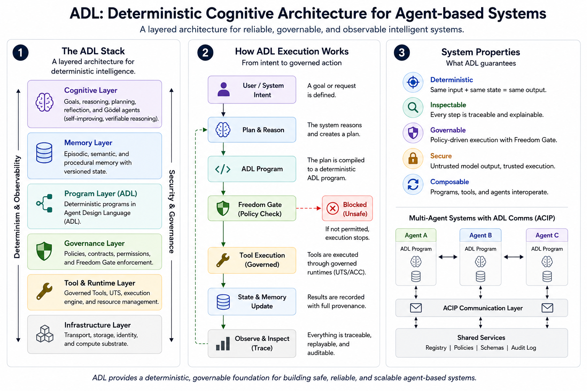

# Agent Design Language (ADL)

Agent Design Language is a deterministic cognitive architecture for building
agent-based systems that are reliable, governable, observable, and reviewable.

ADL is a Rust-backed runtime and documentation system for turning agent work
into explicit programs, governed tool calls, traceable artifacts, review
packets, demos, and milestone evidence.

[](https://github.com/danielbaustin/agent-design-language/actions/workflows/ci.yaml)
[](https://app.codecov.io/gh/danielbaustin/agent-design-language/tree/main)


Homepage: [agent-logic.ai](https://agent-logic.ai)



## Table Of Contents

- [Why ADL Exists](#why-adl-exists)
- [What ADL Provides](#what-adl-provides)
- [Core Ideas](#core-ideas)
- [Quick Start](#quick-start)
- [Recent Demos And Proofs](#recent-demos-and-proofs)
- [Recent Milestones](#recent-milestones)
- [Documentation Map](#documentation-map)
- [Project Status](#project-status)

## Why ADL Exists

Agent systems are crossing from impressive prototypes into real operational
infrastructure. To make that transition safely, they need more than fluent
model output: they need durable programs, explicit authority, governed tools,
state you can trust, and evidence strong enough for teams to build on.

As these systems take on more authority, review and security work also need to
become continuous. Serious agent platforms cannot rely only on occasional audits
or after-the-fact explanations; they need workflows that can find, replay, and
repair weaknesses as part of normal operation.

ADL turns those requirements into an architecture for dependable agent systems:

- deterministic workflows that make agent behavior reproducible
- governed tools that separate model intent from runtime authority
- Freedom Gate policy checks before risky action
- traces, artifacts, and replay surfaces that make outcomes durable
- milestone proof packages that connect product claims to evidence

The project goal is simple: make agent-based systems safe enough to operate,
clear enough to trust, and structured enough to improve.

## What ADL Provides

ADL already has a substantial platform baseline:

- a Rust runtime and CLI for deterministic workflow execution
- explicit workflow, task, agent, provider, and tool artifacts
- bounded concurrency, retry, failure policy, signing, and verification
- run artifacts, traces, replay-oriented inspection, and review records
- governed tool calls through
  [UTS + ACC](docs/explainers/UTS_AND_ACC.md)
- traceable agent communication through [ACIP](docs/explainers/ACIP.md)
- Runtime v2 and CSM Observatory planning and proof surfaces
- Gödel agents and the
  [Gödel-Hadamard-Bayes algorithm](docs/milestones/v0.86/features/GODEL_HADAMARD_BAYES_ALGORITHM.md)
- structured PR/control-plane workflow with SIP, STP, SPP, SRP, and SOR records

For the full capability matrix, read the canonical feature index:
[docs/planning/ADL_FEATURE_LIST.md](docs/planning/ADL_FEATURE_LIST.md).

## Core Ideas

ADL starts with a deterministic runtime. Agent behavior is represented as
explicit programs, bounded state, policy decisions, and replayable artifacts so
intelligence can become infrastructure instead of an unreproducible transcript.

- The ADL runtime and
  [CSM](docs/explainers/CSM.md), the Cognitive Spacetime Manifold, are the
  foundation: they turn agent intent into governed, replayable execution inside
  a persistent runtime world with durable traces, artifacts, state transitions,
  causality, identity continuity, and operator-visible observability.
- [AEE](docs/explainers/AEE.md), the Adaptive Execution Engine, is ADL's
  adaptation lineage: bounded strategy selection, recovery, learning, and
  policy-aware execution without hidden magic.
- The
  [red/blue adversarial security model](docs/explainers/RED_BLUE_SECURITY.md)
  makes attack, defense, exploit replay, and purple-team coordination part of
  the runtime evidence story rather than a separate theater exercise.
- [Gödel agents](docs/explainers/GODEL_AGENTS.md) are the long-running
  direction for self-reference, self-improvement, and reviewable adaptation
  inside the deterministic runtime.
- The
  [Gödel-Hadamard-Bayes algorithm](docs/milestones/v0.86/features/GODEL_HADAMARD_BAYES_ALGORITHM.md)
  is the cognitive loop behind that work: structured awareness, controlled
  hypothesis generation, and evidence-weighted judgment before authorized
  action.
- [UTS + ACC](docs/explainers/UTS_AND_ACC.md) gives the runtime governed tools:
  portable tool shape stays separate from permission, visibility, redaction,
  and audit evidence.
- [ACIP](docs/explainers/ACIP.md) gives agents a communication layer for
  conversation, consultation, delegation, review, handoff, and negotiation that
  remains traceable by the runtime.

## Quick Start

Generate the current v0.91 cognitive-being flagship proof packet:

```bash
cargo run --manifest-path adl/Cargo.toml -- runtime-v2 cognitive-being-flagship-demo --out artifacts/quickstart/cognitive-being-flagship
```

Inspect a current v0.91 multi-agent workflow plan:

```bash
cargo run -q --manifest-path adl/Cargo.toml --bin adl -- adl/examples/v0-91-chatgpt-gemini-claude-triad-conversation.adl.yaml --print-plan
```

## Recent Demos And Proofs

These are three high-signal recent demo entrypoints.

Start with the completed v0.91.4 C-SDLC release evidence lane:

- [v0.91.4 README](docs/milestones/v0.91.4/README.md)
- [v0.91.4 sprint plan](docs/milestones/v0.91.4/SPRINT_v0.91.4.md)
- [v0.91.4 demo matrix](docs/milestones/v0.91.4/DEMO_MATRIX_v0.91.4.md)
- [v0.91.4 release evidence](docs/milestones/v0.91.4/RELEASE_EVIDENCE_v0.91.4.md)

Generate the v0.91 cognitive-being flagship proof bundle:

```bash
cargo run --manifest-path adl/Cargo.toml -- runtime-v2 cognitive-being-flagship-demo --out artifacts/v091/demo-d13-cognitive-being-flagship
```

Run the v0.90.5 governed-tools flagship demo:

```bash
cargo run --manifest-path adl/Cargo.toml -- demo demo-v0905-governed-tools-flagship --run --trace --out artifacts/v0905/flagship-demo --no-open
```

Run the v0.89.1 adversarial self-attack demo:

```bash
cargo run --manifest-path adl/Cargo.toml -- demo demo-h-v0891-adversarial-self-attack --run --trace --out .adl/reports/adversarial-demo --no-open
```

Review the v0.91
[ChatGPT + Gemini + Claude triad conversation](demos/v0.91/chatgpt_gemini_claude_triad_conversation_demo.md)
from issue
[#2764](https://github.com/danielbaustin/agent-design-language/issues/2764).

## Recent Milestones

### v0.91.8 - Active Bridge Milestone

v0.91.7 is now published as the [ADL v0.91.7 GitHub release](https://github.com/danielbaustin/agent-design-language/releases/tag/v0.91.7)
and remains the implementation/readiness tranche feeding the active v0.91.8
bridge.
v0.91.8 has advanced through WP-16. The integrated quality gate merged at
`2e9d2dd7c` and records 67 audited issue outcomes, 0 unacceptable outcomes,
and passing ADL v2, Runtime v3, and C-SDLC v2 focused/integrated lanes. The
bridge is still not release-approved: WP-17 documentation alignment,
milestone review, remediation/preflight, v0.92 handoff truth, and release
ceremony remain explicit release-tail work.

Start here:

- [v0.91.8 README](docs/milestones/v0.91.8/README.md)
- [v0.91.8 sprint plan](docs/milestones/v0.91.8/SPRINT_PLAN_v0.91.8.md)
- [v0.91.8 issue wave](docs/milestones/v0.91.8/WP_ISSUE_WAVE_v0.91.8.yaml)
- [v0.91.8 parallel plan](docs/milestones/v0.91.8/PARALLEL_EXECUTION_PLAN_v0.91.8.md)
- [v0.91.8 WP-16 quality gate](docs/milestones/v0.91.8/evidence/wp16/QUALITY_GATE.md)
- [v0.91.8 issue outcome audit](docs/milestones/v0.91.8/evidence/wp16/ISSUE_OUTCOME_AUDIT.md)
- [v0.91.8 to v0.92 handoff](docs/milestones/v0.91.8/NEXT_MILESTONE_HANDOFF_v0.91.8.md)
Historical v0.91.7 evidence:
- [v0.91.7 README](docs/milestones/v0.91.7/README.md)
- [v0.91.7 sprint plan](docs/milestones/v0.91.7/SPRINT_PLAN_v0.91.7.md)
- [v0.91.7 issue wave](docs/milestones/v0.91.7/WP_ISSUE_WAVE_v0.91.7.yaml)
- [v0.91.7 feature-doc index](docs/milestones/v0.91.7/FEATURE_DOCS_v0.91.7.md)
- [v0.91.7 sprint-review register](docs/milestones/v0.91.7/review/V0917_SPRINT_REVIEW_REGISTER.md)

### v0.91.6 - Completed First Bridge Tranche

v0.91.6 is the completed first pre-v0.92 bridge/readiness tranche. Its retained
handoff and release-tail evidence are inputs to v0.91.7; they are historical
records rather than the current review entrypoint.

Start here:

- [v0.91.6 README](docs/milestones/v0.91.6/README.md)
- [v0.91.6 sprint plan](docs/milestones/v0.91.6/SPRINT_PLAN_v0.91.6.md)
- [v0.91.6 issue wave](docs/milestones/v0.91.6/WP_ISSUE_WAVE_v0.91.6.yaml)
- [v0.91.6 feature-doc index](docs/milestones/v0.91.6/FEATURE_DOCS_v0.91.6.md)

### v0.91.5 - Previous Bridge Package And Release-Tail Input

v0.91.5 remains the immediate upstream bridge package between the C-SDLC
rollout closeout and the v0.92 first-birthday milestone. It carried
multi-agent stabilization, provider/model breadth, public prompt records, demo
readiness, AEE completion routing, and activation testing so v0.91.6 and
v0.91.7 could open from a cleaner operational base.

Start here:

- [v0.91.5 README](docs/milestones/v0.91.5/README.md)
- [v0.91.5 sprint plan](docs/milestones/v0.91.5/SPRINT_v0.91.5.md)
- [v0.91.5 issue wave](docs/milestones/v0.91.5/WP_ISSUE_WAVE_v0.91.5.yaml)
- [v0.92 activation test map](docs/milestones/v0.91.5/V092_ACTIVATION_TEST_MAP_v0.91.5.md)

### v0.91.4 - Completed Cognitive SDLC Default-Operation Milestone

v0.91.4 is complete as the Cognitive SDLC completion and hardening milestone.
Its issue wave closed through Sprint 4 release ceremony, and the crate version
is `0.91.4`. The milestone turns the v0.91.3 first slice into default
operating practice:
validator/doctor/conductor/editor alignment, signed trace and ObsMem handoff
hardening, five-minute-sprint repeatability, validation-tail/PVF work, and
bounded sidecar evidence for CodeFriend and WildClawBench.

Start here:

- [v0.91.4 README](docs/milestones/v0.91.4/README.md)
- [v0.91.4 issue wave](docs/milestones/v0.91.4/WP_ISSUE_WAVE_v0.91.4.yaml)
- [v0.91.4 sprint plan](docs/milestones/v0.91.4/SPRINT_v0.91.4.md)
- [v0.91.4 demo matrix](docs/milestones/v0.91.4/DEMO_MATRIX_v0.91.4.md)
- [v0.91.4 quality gate](docs/milestones/v0.91.4/QUALITY_GATE_v0.91.4.md)
- [v0.91.4 release evidence](docs/milestones/v0.91.4/RELEASE_EVIDENCE_v0.91.4.md)

### v0.91.3 - Completed Cognitive SDLC First-Slice Milestone

v0.91.3 is complete. It proved one bounded Cognitive State Transition with
tracked cards, transition evidence, review synthesis, merge-readiness truth,
ObsMem handoff, and a reviewer-facing first-proof/demo package. It does not
claim full C-SDLC default operation; v0.91.4 owns repeatability, enforcement,
signed trace proof, validation-tail hardening, and default adoption for future
software-development issues.

### v0.91.2 - Completed Tooling, Evaluation, Productization, And Workflow Pressure Release

v0.91.2 is complete. It closed the UTS + ACC benchmark, runtime/test-cycle
recovery, CodeFriend productization, Workspace bridge, modernization,
publication packet, rustdoc/doc cleanup, repo-visibility follow-on, and
workflow-guardrail pressure-release band. Its release-tail review, remediation,
next-milestone planning, and ceremony work prepared v0.91.3 and v0.91.4.

### v0.91.1 - Completed Inhabited Runtime Readiness Milestone

v0.91.1 is complete. The core implementation, review, next-milestone handoff,
final next-milestone review-pass wave, and release ceremony package landed
before v0.91.2 opened.

It ended with an observatory-visible agent runtime proof inside the CSM
boundary: lifecycle state, citizen standing/state, memory/identity
architecture, Theory of Mind, capability testing, intelligence metrics,
governed learning, secure ACIP/A2A hardening, and an agent-shaped runtime run
that remains explicit about non-claims for birthday, identity continuity, and
external federation.

Start here:

- [v0.91.1 README](docs/milestones/v0.91.1/README.md)
- [v0.91.1 issue wave](docs/milestones/v0.91.1/WP_ISSUE_WAVE_v0.91.1.yaml)
- [v0.91.1 execution readiness](docs/milestones/v0.91.1/WP_EXECUTION_READINESS_v0.91.1.md)
- [v0.91.1 release readiness](docs/milestones/v0.91.1/RELEASE_READINESS_v0.91.1.md)

### v0.91 - Released Moral Governance And Cognitive-Being Milestone

v0.91 is the completed `0.91.0` milestone. Its core line landed
the moral governance, wellbeing, kindness, humor, affect, cultivated
intelligence, structured planning, SRP, and secure intra-polis Agent Comms
band. Internal review, third-party review, accepted-finding remediation,
next-milestone handoff, release ceremony, tag, and release publication are
complete.

Start here:

- [v0.91 README](docs/milestones/v0.91/README.md)
- [v0.91 feature index](docs/milestones/v0.91/features/README.md)
- [v0.91 release plan](docs/milestones/v0.91/RELEASE_PLAN_v0.91.md)
- [v0.91 release readiness](docs/milestones/v0.91/RELEASE_READINESS_v0.91.md)

### v0.90.5 - Completed Governed Tools v1.0

v0.90.5 is the completed Governed Tools v1.0 milestone. It landed:
Universal Tool Schema, ADL Capability Contract, deterministic registry and
compiler surfaces, governed execution policy, trace/replay/redaction evidence,
dangerous negative proofs, model compatibility work, and the first ACIP/Comms
integration slice.

Start here:

- [v0.90.5 release readiness](docs/milestones/v0.90.5/RELEASE_READINESS_v0.90.5.md)
- [v0.90.5 release evidence](docs/milestones/v0.90.5/RELEASE_EVIDENCE_v0.90.5.md)
- [v0.90.5 release notes](docs/milestones/v0.90.5/RELEASE_NOTES_v0.90.5.md)

### v0.90.4 - Completed Citizen Economics And Contract Market

v0.90.4 is the completed bounded citizen-economics and contract-market
milestone. It made contract schema, bid schema, evaluation, lifecycle,
transition authority, external counterparty boundaries, delegation, and one
bounded contract-market proof legible without claiming payment rails or
production markets.

## Documentation Map

- [Feature list](docs/planning/ADL_FEATURE_LIST.md): canonical capability
  overview and roadmap truth.
- [Explainers](docs/explainers/README.md): short entrypoints for UTS + ACC,
  ACIP, AEE, red/blue security, Gödel Agents, and CSM.
- [Docs index](docs/README.md): repository documentation entrypoint.
- [Changelog](CHANGELOG.md): milestone-level project history.
- [ADRs](docs/adr/README.md): architecture decisions.
- [GHB algorithm](docs/milestones/v0.86/features/GODEL_HADAMARD_BAYES_ALGORITHM.md):
  cognitive loop behind Gödel-agent work.
- [Examples](adl/examples/README.md): runnable ADL examples.
- [Demos](demos/README.md): demo-oriented proof surfaces.
- [AGENTS.md](AGENTS.md): repository-local operating contract for coding agents.

## Project Status

- Active milestone: v0.91.8 bridge, release-tail WP-18 #5791
- Active sprint umbrella: #5595
- Downstream milestone: v0.92 consumes exact-revision v0.91.8 acceptance and handoff
- Current ADL and Runtime v2 crate version: 0.91.8
- Independent Runtime v3 kernel package version: 0.92.0; it remains separately
  versioned and does not by itself claim v0.92 activation readiness
- Most recently completed implementation/readiness tranche and public release:
  v0.91.7 ([GitHub release](https://github.com/danielbaustin/agent-design-language/releases/tag/v0.91.7))
- The active v0.91.8 bridge remains unreleased pending its documented gates.
- Current milestone state: WP-16 quality gate passed at `2e9d2dd7c`; WP-17
  documentation truth alignment is closed, WP-18 final internal review is
  active, and later release-tail remediation, handoff, and ceremony gates
  remain open.
- Primary implementation language: Rust

ADL is under active development. The repository contains implemented runtime
surfaces, completed milestone evidence, active milestone docs, and forward
planning. Treat milestone documents as bounded engineering records: they say
what is implemented, what is demoable, what is under active execution, and what
remains planned.
