# Runtime v3 Adaptive Reasoning Architecture

Status: implemented issue boundary for #5180 in Runtime v3 mini-sprint #5174.

Source evidence: `adl-runtime-kernel/src/reasoning.rs` and
`adl-runtime-kernel/tests/reasoning.rs`.

## Architecture

Runtime v3 represents reasoning as five runnable deterministic components over
one compact domain module. Their factories form a topology-valid chain using
existing typed ports and capability contracts. Each injected service owns its
domain state and completes a role-specific bounded preflight before readiness;
no reasoning behavior is added to the kernel supervisor.

The current proof chain coordinates through injected typed service state. Port
declarations are contract metadata for the later message-bus binding; #5180
does not claim that `ReasoningEnvelope` is already transported by the kernel.

- `reasoning_graph` validates immutable, versioned DAG definitions with
  `petgraph` and produces canonical order and identity.
- `loop_executor` applies bounded recurrence around the DAG. Iteration count,
  deadline, and cancellation are explicit. Its startup probe performs one
  retained iteration, so its contract truthfully declares non-idempotent start.
- `evaluation_feedback` produces integer-valued evaluation and feedback
  records from retained observations.
- `adaptation_state` is a versioned, reviewable reducer state, supports
  authenticated graph-version migration, and implements the existing
  checkpoint-participant contract.
- `mutation_gate` verifies Ed25519 grants, applies typed patches to a copy,
  revalidates the candidate, and returns provenance and rollback evidence.

Provider calls are outside deterministic execution. The input is a typed
`RecordedObservation` containing a bounded identity, score, and evidence hash;
prompts, provider internals, and credentials do not enter adaptation state.

## Invariants

Graph validation enforces schema and version identity, stable unique node IDs,
node and edge ceilings, endpoint validity, duplicate-edge refusal, acyclicity,
entry reachability, and exact terminal exit declarations. Canonical sorting
before hashing makes node and edge insertion order irrelevant.

Loops return `converged`, `exhausted`, or `cancelled`. Scores are integers and
all state and sequence increments are checked. Each iteration emits a
hash-chained replay event containing the prior state hash and typed next state.
The loop target is bound into adaptation state.
Resume requires matching graph, policy, checkpoint-state, sequence, and replay
anchor identities; gaps, reordering, substitution, and state discontinuity
fail closed. The adaptation store accepts only a `LoopOutcome` whose replay is
semantically recomputed from its current checkpoint; it has no arbitrary-state
publication API.

Mutation authority binds a principal to a trusted Ed25519 key. One-shot grants
bind the current graph and policy identities, exact patch hash, allowed
operation classes, provenance, expiry, patch count, and graph-size limits.
Trusted time is an explicit required capability. The mutation gate atomically
publishes the graph, adaptation graph identity, consumed grant, and bounded
evidence while holding both state locks; refusal leaves the prior graph and
adaptation state authoritative. Accepted evidence retains the signed grant plus
before, after, patch, policy, principal, provenance, integrity, and rollback
identities. Rollback derivation is pure and does not mutate gate state without
a separately governed publication. The active graph, consumed grants, and
evidence are checkpointed together, so restart cannot revive a spent grant.
Evidence consumers reverify the retained Ed25519 grant before migration or
rollback, retain and reapply the exact grant-bound patches, and bind adaptation
migration to the active gate revision.

Graph mutation is a checkpoint boundary, not a loop iteration. It advances the
state schema version without inventing a replay sequence event. A crash before
the next checkpoint recovers the prior graph/state snapshot; the mutation-gate
snapshot retains the graph, matching adaptation state, spent grants, and
evidence together. #5180 does not claim replay through a graph mutation from an
older checkpoint.

## COTS Boundary

- `petgraph`: graph construction, traversal, and cycle/topological checks.
- `serde` and `serde_json`: typed review and checkpoint schemas.
- `blake3`: graph, state, patch, and replay identities.
- `ed25519-dalek` and `hex`: signed mutation grants and encoding.
- Tokio: cancellation and deadline enforcement.
- Existing Runtime v3 continuity contracts: checkpoint participation and
  deterministic replay validation.

Runtime v3 does not implement graph algorithms, cryptography, serialization,
async scheduling, provider SDKs, or a second workflow engine.

## Proof Boundary

Focused tests prove canonical graph identity, invalid graph refusal, bounded
convergence and exact exhaustion, cancellation, checkpoint projection,
replay/resume and forgery refusal, signed mutation, expiry and stale-policy
refusal, invalid cyclic mutation, rollback, and service-contract validity.

Remote provider calls, autonomous self-modification, production policy
issuance, and cross-runtime shadow parity are not claimed by #5180.

## Budget

At this boundary Runtime v3 contains 5,361 Rust implementation lines and 61
tests. #5180 adds 1,388 implementation lines and thirteen tests. The mini-sprint
remains below its 10,000 implementation-LoC challenge target and 1,000-test
ceiling.
