# Runtime v3 Configuration, Registry, And System Weather

Status: implemented issue boundary for #5182 in Runtime v3 mini-sprint #5174.

Source evidence: adl-runtime-kernel/src/config.rs,
adl-runtime-kernel/src/topology.rs, adl-runtime-kernel/src/weather.rs, and
adl-runtime-kernel/tests/configuration.rs.

## Baseline Comparison

The basic Runtime v3 architecture remains one guardian around one Tokio kernel
and one supervised component set. This issue adds two small preconditions:
declarative configuration is validated before construction, and system weather
reports resource conditions through a platform-neutral contract.

It does not add a dynamic plugin loader, global service locator, second
scheduler, dashboard, system cleaner, or replacement for closeout-driven
worktree pruning.

    RuntimeConfig -> FactoryRegistry -> contract/topology gate -> Tokio kernel
    platform probes -> SystemWeather -> observability -> CloudWatch adapter
                                       -> continuity checkpoint/stop

## Configuration Contract

RuntimeConfig uses schema adl.runtime.config.v1 and rejects:

- unknown schema versions and unknown fields;
- duplicate or empty component identities;
- duplicate and self dependencies;
- missing or duplicate configured factories;
- factory identity or dependency drift;
- service-contract, capability, port, and topology failures;
- secret-like fields in canonical component parameters; and
- invalid sampling, checkpoint, concurrency, or hysteresis bounds.

The registry type-erases only configured construction. Components retain the
existing typed ports and ComponentFactory boundary. Construction produces a
ConfiguredTopology containing the validated topology, validated contracts, and
deterministic effective JSON. Environment values and credentials have no
designated field in that canonical projection. Key-name validation is a
guardrail, not content-based secret detection.

## System Weather Contract

The common observer uses the maintained MIT-licensed sysinfo crate for Linux
and macOS:

- total and per-core CPU use;
- total and available memory;
- disk capacity per mount;
- network byte counters; and
- available component temperatures.

Metrics use integer basis points, bytes, and millicelsius. Every observation
carries source and availability. GPU is explicitly unavailable until a small
reviewed platform adapter is registered; absence is never reported as zero.

Resource policy has healthy, warning, and stop_required states. Hysteresis
prevents flapping, and recovery requires positive healthy CPU, memory, and disk
evidence. This issue reports stop_required; #5181 owns fast parallel checkpoint
and graceful stop.

## Ownership Boundaries

- #5181 owns admission freeze, parallel serialization, checkpoint commit, and
  intentional stop.
- #5177 owns local history, health events, and control-plane presentation.
- #5183 owns asynchronous bounded CloudWatch export.
- #5175 owns guardian classification, restart eligibility, and pressure soak.

The legacy adl-runtime/src/backpressure.rs remains behavior evidence only.
Runtime v3 retains bounded channel full policies and external I/O admission.
Disk exhaustion from stale issue worktrees is corrected by pr-closeout pruning,
not by a runtime subsystem.

## Budget

At this issue boundary, Runtime v3 remains under the 10,000 implementation-LoC
target and has 30 focused tests, below the sprint limit of 1,000.
