# Runtime v3 Continuity, Replay, And Recovery

Status: implemented issue boundary for #5181 in Runtime v3 mini-sprint #5174.

Source evidence: adl-runtime-kernel/src/continuity.rs and
adl-runtime-kernel/tests/continuity.rs.

## Baseline Comparison

Runtime v3 keeps continuity outside the supervisor loop. The kernel still owns
task lifecycle; one continuity coordinator owns the operational checkpoint
transaction. The transaction has a global quiesce barrier followed by bounded
parallel service serialization, so no snapshot starts while another service is
still accepting state changes.

    weather stop_required -> close admission -> quiesce barrier
      -> bounded parallel service snapshots -> synced independent blobs
      -> signed manifest -> atomic generation commit -> kernel shutdown

This is smaller than carrying snapshot and recovery behavior through many
domain modules. Durable services implement one CheckpointParticipant contract.

## Checkpoint Contract

Each versioned manifest records generation, accepted event sequence,
provenance, topology identity, canonical configuration identity, migration
policy, service schemas, blob lengths, BLAKE3 checksums, manifest integrity,
Ed25519 algorithm/key identity, and an Ed25519 signature.
Blobs are written independently and synced before the manifest is published.
The generation directory becomes visible through one atomic rename.
The deadline bounds quiesce and serialization; once durable publication starts,
commit runs to a definite success or failure so cancellation cannot leave the
caller's checkpoint result inconsistent with filesystem truth.

BLAKE3 provides fast corruption and substitution detection for each blob.
Ed25519 authenticates the canonical manifest and therefore every recorded blob
checksum. The signing key is injected at runtime and never stored in canonical
configuration or checkpoint data; recovery accepts only externally configured
trusted public keys. Compromise of an authorized signing key remains outside
this issue's claim.

## Fast Serialization

The coordinator uses the existing Futures stream combinators over Tokio:

1. quiesce participants concurrently with a configured bound;
2. wait for every participant to cross the barrier;
3. serialize participants concurrently with the same bound;
4. sort completed snapshots by service identity before committing evidence.

The test suite proves actual overlap with an atomic maximum-concurrency probe.
No new executor, thread pool, serialization framework, or monolithic state
object is introduced.

## Replay And Recovery

Replay events form a BLAKE3 hash chain over schema, sequence, event type,
payload, and prior hash. Validation rejects unsupported schemas, gaps,
reordering, and payload substitution.

Recovery decisions are deliberately small:

- restart_fresh when no checkpoint exists;
- rehydrate when all integrity and identity checks pass;
- quarantine for corrupt or incomplete evidence; and
- fatal_refusal for unsupported schema or incompatible topology/config/service
  identity.

Corrupt files remain in place as evidence. Operational checkpoint and
autobiographical lifelog roots must be disjoint and non-nested.

## Graceful Resource Stop

The #5182 weather service supplies the resource-pressure decision. This issue
attempts the bounded checkpoint and then requests normal kernel shutdown.
Checkpoint deadline or participant failure is retained as incomplete truth but
does not turn an intentional resource stop into a crash. #5175 owns guardian
restart eligibility while capacity remains unsafe.

## Budget

At this boundary Runtime v3 contains 3,031 Rust implementation lines and 37
tests. #5181 added 691 implementation lines and seven tests.
