# Runtime v3 Control, Health, And Observability

Status: implemented issue boundary for #5177 in Runtime v3 mini-sprint #5174.

Source evidence: `adl-runtime-kernel/src/control.rs`,
`adl-runtime-kernel/src/telemetry.rs`, `adl-runtime-kernel/src/channel.rs`, and
`adl-runtime-kernel/tests/control.rs`.

## Architecture Comparison

Runtime v3 keeps the operator policy core transport-neutral. A thin Axum HTTP
adapter accepts signed command envelopes, but authenticated command policy and
kernel lifecycle authority do not live in transport handlers. The production
listener binds canonical Runtime v3 control port `20997`; alternate
transports may share that port through one adapter-owned router rather than
inventing additional undocumented control ports.

    operator / guardian adapter
      -> Ed25519 authentication + capability authorization
      -> bounded idempotency record
      -> supervisor-owned lifecycle command
      -> correlated result

Read commands clone one revisioned recorder state under one mutex. Queue
metrics are each captured under their own single state lock and carry a queue
generation, so consumers can distinguish recorder changes from live queue
movement without combining independently sampled counters.

## Coherent Health Contract

The versioned snapshot includes:

- topology generation;
- component running, degraded, restarting, stopped, and failed state;
- restart counts;
- queue generation, capacity, current depth, high-water mark, sent count, and
  rejected count;
- qualified clock authority;
- checkpoint generation, accepted sequence, topology/config identity, and
  manifest integrity projection;
- runtime lifecycle state;
- observability readiness or bounded degradation reason; and
- retained event count and monotonic snapshot revision.

Checkpoint signatures, private keys, blobs, paths, and uncontrolled provenance
are not projected into health responses.

## Governed Commands

Every command is a canonical Ed25519-signed envelope containing schema,
principal, command identity, correlation identity, action, and key identity.
Externally supplied trusted public keys bind principals to explicit `read` or
`stop` capabilities. Authentication precedes schema and authorization
classification, and errors never echo signatures or credentials.

Mutating commands reserve an idempotency record before lifecycle execution.
Identical retries return the original result, mismatched command reuse is
rejected, and concurrent duplicates cannot execute a second transition. The
cloneable `KernelControl` sends shutdown into the existing supervisor actor;
the control service does not own a parallel lifecycle state machine.

## Output And Observability

Machine payload encoding writes JSON only to the caller-supplied payload stream.
Human events use the repository `adl_event` contract on stderr. Event and
correlation fields accept only bounded identifiers; unsafe values are rejected
or redacted before `tracing`, stderr, or Vector can observe
them. Raw component failure text is no longer interpolated into public runtime
events.

The kernel uses the maintained `tracing` crate and emits structured `adl_event`
records to stderr. Vector is the external observability component: it owns
collection, parsing, buffering, retry, transformation, and downstream OTLP or
CloudWatch export. The kernel does not embed an OpenTelemetry SDK or reimplement
collector behavior. Bootstrap events promote exactly once after local
observability is explicitly classified ready or degraded, so an unavailable
Vector process leaves stderr, health, and lifecycle control operational.

The checked-in Vector configuration proves the local stderr-to-Vector parsing
contract and keeps remote sinks as deployment configuration. CloudWatch,
dashboard, and remote trace persistence are not claimed by this issue.

## Budget

At this boundary Runtime v3 contains 3,973 Rust implementation lines and 48
tests. #5177 adds 942 implementation lines and eleven tests. The mini-sprint
remains well below its 10,000 implementation-LoC challenge target and 1,000-test
ceiling.
