# Runtime v3 Governed Execution Architecture

Status: implemented issue boundary for #5178 in Runtime v3 mini-sprint #5174.

Source evidence: `adl-runtime-kernel/src/governance.rs` and
`adl-runtime-kernel/tests/governance.rs`.

## Architecture

Runtime v3 exposes four small service contracts:

- `governance_ingress` accepts typed action requests.
- `freedom_gate` validates policy-issued commitments, signed authority and
  attenuating delegation, revocation, replay identity, trusted time, and
  resource availability before issuing a signed one-shot permit.
- `aee` is the explicitly governed nondeterministic shell. It accepts only a
  verified permit, invokes an injected `ActuationShell`, and records a bounded
  deterministic result projection. Failed or oversized results are
  quarantined.
- `governance_audit` owns the typed audit output boundary.

The lifecycle components declare topology and contract ownership. Domain work
is performed through `FreedomGate::mediate` and `Aee::actuate`; #5178 does not
claim that the kernel already transports these port values over a message bus.

## Authority Contract

Commitments are Ed25519-signed by a trusted policy key and bind principal,
action, resource, unit ceiling, policy identity, and expiry. Authority grants
bind the same execution dimensions plus delegation depth. Every delegated
grant references its signed parent hash and must attenuate units and remaining
depth. Missing, forged, expired, revoked, stale, escalated, or replayed
authority fails closed.

The gate reserves resource units and consumes the request identity in the same
critical section that emits the signed permit. Refusals retain reason, request
and policy identity, prior audit identity, and a canonical evidence hash.
Operator decisions are independently signed and appeals retain both refusal
and operator-decision identities.

## Actuation Boundary

The provider or tool implementation is an injected `ActuationShell`; Runtime
v3 does not reimplement provider, cloud, or tool SDKs. AEE verifies the gate
signature before calling the shell and consumes each permit once. Result bytes
are bounded, hashed, and attached to a canonical audit event. Shell errors are
retained as quarantined records rather than escaping as ungoverned effects.

## Continuity

Freedom Gate and AEE implement the existing Runtime v3
`CheckpointParticipant` contract. Gate snapshots retain resource balances,
revocations, consumed request identities, refusal/appeal evidence, and the
audit chain. AEE snapshots retain consumed permits, result records, and its
audit chain. Restore validates schemas, evidence integrity, and audit-chain
continuity before execution resumes.

## COTS Boundary

- `ed25519-dalek`: commitment, authority, operator, and permit signatures.
- `serde` and `serde_json`: typed records and checkpoint projections.
- `blake3`: canonical request, evidence, result, and audit identities.
- Tokio and `async-trait`: nondeterministic shell boundary and lifecycle.
- Existing Runtime v3 component, contract, supervisor, and continuity APIs.

No cryptography, async executor, serialization format, provider SDK, or policy
language is implemented locally.

## Proof Boundary

Eleven focused tests prove allowed mediation and actuation, missing and forged
authority refusal, stale policy refusal, signed attenuating delegation,
resource exhaustion, commitment revocation, replay refusal, signed appeal and
operator evidence, quarantine, checkpoint recovery, and supervised typed
contracts.

Private-state policy authoring, constitutional theorem proving, message-bus
transport, production provider integrations, distributed authority, and
operator UI are not claimed by #5178.

## Budget

At this boundary Runtime v3 contains 6,564 Rust implementation lines and 72
tests. #5178 adds 1,203 implementation lines and eleven tests. The mini-sprint
remains below its 10,000 implementation-LoC challenge target and 1,000-test
ceiling.
