# Runtime v3 Guardian And Soak

Issue `#5175` closes the Runtime v3 mini-sprint with an external-guardian
bakeoff, native packaging, adversarial process proof, bounded integrated
soak, and an explicit disposition. Runtime v2 remains the default and no
artifact in this packet authorizes cutover.

## Guardian-Neutral Child Contract

Every guardian starts the same `adl-runtime-kernel serve --init <init-path> --continuity-root <checkpoint-directory>`
process. The child owns component supervision, readiness, typed bounded
channels, continuity, and graceful shutdown. The external guardian owns
environment injection, stdout/stderr capture, signal delivery, child reaping,
restart delay, and process restart. The child accepts `SIGINT` and `SIGTERM`,
classifies fatal exits, and never embeds guardian-specific configuration.
Continuity-signing and operation-permit keys are distinct host-injected
identities and never enter the canonical init file. Runtime startup rejects
reuse of the same Ed25519 identity for both roles. Every retained live
checkpoint binds its signed generation to the directory generation and signs
the previous manifest integrity; restore validates that predecessor chain back
to the operator-supplied minimum generation.

The registry retains the complete 26-service contract inventory, but health is
not inferred from membership. Unconfigured operational adapters and passive
governance, cognition, weather, and continuity component shells are reported
`Degraded` before API readiness. Only components that execute live in-process
behavior report `Running`.

## Bakeoff

| Guardian | Liveness/restart | Signals/reaping/output | Portability and maintenance | Security posture | Disposition |
|---|---|---|---|---|---|
| systemd | Native service and restart/backoff; cgroup ownership | `SIGTERM`, `KillMode=control-group`, journal capture | Linux only | Dynamic user, state directory, resource and capability bounds | Qualified optional Linux containment adapter |
| rustysd | Common unit subset supports `Restart=always`; fixed pre-start delay | Process supervision and output capture | Linux proof candidate; upstream describes itself as work in progress | Smaller surface, insufficient production hardening evidence | Retained proof candidate only |
| Horust 0.1.13 | Executed `on-failure` restart with 100ms incremental backoff; configured attempts do not bound repeated post-start crashes | `SIGTERM`, output forwarding, child supervision | Built on macOS and targets Unix hosts; upstream documents macOS orphan-reaping limitations | Inherits launcher identity and limits; dedicated unprivileged account required | Selected portable Unix candidate; bounded-restart qualification blocked by upstream #318 |
| launchd | KeepAlive and native process ownership | Native signal/log integration | Supported macOS platform service | Native service isolation controls | Compatible future adapter; not packaged here |

`initd` remains out of scope because it is a PID 1 bootstrap layer rather than
the child service manager this contract requires.

The retained native Horust proof executes both sides of the guardian contract:
one injected fatal child exit is restarted and restores continuity at generation
2; terminating Horust forwards `SIGTERM`, lets the kernel checkpoint generation
1, and leaves control port `20997` closed.

Horust 0.1.13's `OnFailure` path does not apply the configured attempt limit,
and its `Never` startup-failure counter resets when a child reaches `Started`.
A native always-failing child therefore remains in a crash loop instead of
exhausting the configured budget. This is retained as a cutover blocker and
reported upstream at `https://github.com/FedericoPonzi/Horust/issues/318`.
The proposed upstream repair is under review at
`https://github.com/FedericoPonzi/Horust/pull/319`; ADL remains pinned to the
published 0.1.13 release and blocked until a corrected release is available and
the native qualification suite passes against that release.

## Packaging

- `infra/horust/adl-runtime-kernel.toml` is the selected portable Unix
  guardian candidate; adoption remains blocked.
- `infra/systemd/adl-runtime-kernel.service` is an optional Linux adapter.
- `infra/rustysd/adl-runtime-kernel.service` remains a compatibility fixture,
  not a production recommendation.

## Issue 5211 Qualification

The retained `runtime_v3_horust_qualification_report.v1.json` records the
cross-platform qualification result without promoting local artifact paths or
cloud account identifiers into repository truth.

- macOS passed seven guardian-package tests, five of which exercise native
  Horust supervision; the packet also includes a 100-cycle runtime soak and a
  direct `serve` SIGTERM test.
- Linux on Nessus passed focused Horust packaging, restart-budget, isolation,
  restart-continuity, and configuration-failure tests on an NVIDIA RTX 3090
  host. This is focused coverage, not a complete Linux soak or
  signal-forwarding qualification. Nessus could not prove systemd containment
  because its
  WSL2 environment exposes an offline systemd and hybrid cgroup-v1 surface.
- A disposable Linux Spot host proved the checked-in systemd unit starts in
  `/system.slice/adl-runtime-kernel.service`, applies `DynamicUser=yes`,
  `KillMode=control-group`, strict filesystem protections, a 2 GiB memory
  ceiling, and a 512-task ceiling, then stops and terminates cleanly.
- The smallest practical GPU Spot launch was attempted separately. No GPU
  instance launched: `g4dn.xlarge` and `g5.xlarge` are offered in multiple
  regions, but the account's G/VT Spot quota is zero. The only advertised P3
  shape, `p3dn.24xlarge`, needs 96 vCPUs against the approved eight-vCPU
  P-family Spot quota. This is retained as a blocked infrastructure proof and
  makes no GPU-runtime claim.

Horust adoption remains blocked by upstream issue 318. Passing platform,
containment, and isolation gates does not compensate for an unbounded restart
loop.

Issue `#5224` reviews fallback candidates while that upstream Horust path is
blocked. The retained fallback decision is
`docs/architecture/RUNTIME_V3_GUARDIAN_FALLBACK_DECISION.md`: no reviewed COTS
candidate is a drop-in cross-platform external guardian replacement. If Horust
remains blocked, the next path is a separate follow-on that first tests whether
`rust-tokio-supervisor` can supervise a narrow wrapper task that owns the
runtime kernel as a `tokio::process` child, and otherwise builds a small
ADL-owned Tokio process guardian shim that preserves the same child contract
and uses COTS crates only for bounded supporting concerns.

## Soak Gate

The bounded soak repeats integrated kernel execution and continuity recovery,
then injects component restart, child crash, queue saturation, corrupt
continuity, degraded clock startup, and shutdown-deadline failure. Separate
adversarial parity tests cover process-tree leaks, timeouts, oversized output,
invalid fixture identifiers, and deliberately divergent runtime output.

The retained report records exact iteration count and outcomes. It is a bounded
engineering soak, not a claim of multi-day production endurance. A later
deployment qualification must add host-specific duration, telemetry delivery,
and operational SLO evidence.

Issue `#5253` retains the v0.91.7 cutover-prerequisite soak and rollback
packet at `docs/architecture/runtime_v3_soak_rollback_5253.v1.json`. That
packet preserves the same bounded-soak evidence while making the cutover
boundary explicit: Runtime v3 selection is opt-in, Runtime v2 remains the
default and rollback target, remote multi-day soak and GPU telemetry are
deferred non-cutover lanes, and Horust bounded restart remains blocked until a
fixed release is qualified.

## Current Disposition

The pre-soak Fable 5 architecture review recommended **continue incubation**
and identified five P1 findings in the parity evidence boundary. Those findings
were remediated before the bounded soak ran. Final Fable 5 delta verification
and the independent review stack found no remaining actionable findings and
marked `#5175` ready for closeout under continued incubation. Automatic cutover
is never an available outcome.

Process groups bound ordinary descendants during the parity soak, but they are
not an OS security boundary against a trusted fixture that deliberately creates
a new session. Killing a numeric process group after reaping its leader also has
a theoretical identifier-reuse race when no descendants remain. Issue `#5211`
qualified the optional systemd adapter's Linux cgroup and host resource bounds;
the Horust process-group gap and upstream restart-budget defect remain blockers.
