# Runtime v3 Operational Components

Issue `#5183` proves the Runtime v3 component contract across ten operational
service roles without introducing ten service-specific implementations. One
`OperationalAdapter` boundary declares authority, capacity, concurrency,
timeout, retry, idempotency, lifecycle, and deterministic-shell behavior.

External SDKs remain behind `OperationExecutor`; the Tokio kernel owns bounded
execution and supervision. Production provider, cloud, and protocol SDK
selection is intentionally outside this deterministic fixture issue.

The retained architecture remains aligned as follows:

- The kernel and component contracts are the asynchronous runtime and CSM
  orchestration planes.
- Freedom Gate supplies governed authority before provider or cloud actuation.
- Agents, shepherd, scheduler, time, networking, storage, and lifelog all use
  the same lifecycle and failure contract.
- Nondeterministic provider, clock, network, and cloud behavior stays behind
  adapters; deterministic fixtures exercise the core without credentials.
- Checkpoint storage remains operational continuity; lifelog remains a
  distinct autobiographical service.
