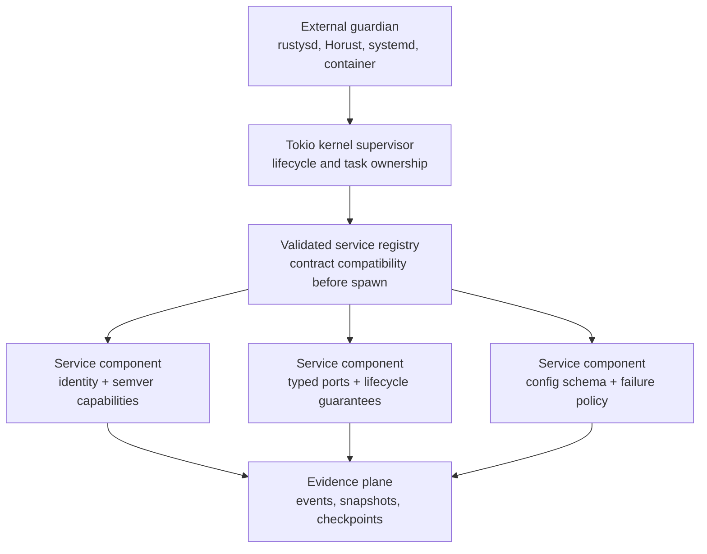
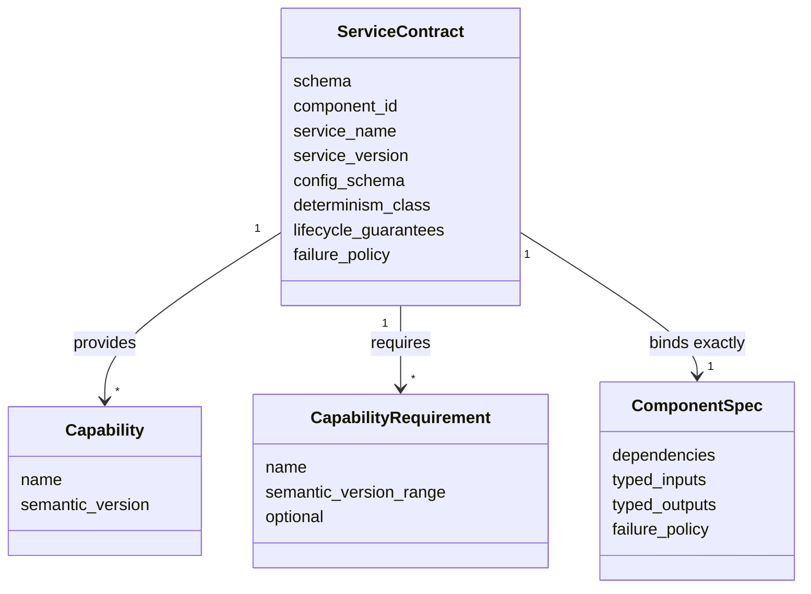

# Runtime v3 Service Contract Architecture

Status: design-by-contract gate for #5176 in Runtime v3 mini-sprint #5174.

Diagram family/backend: architecture flowchart and contract class model in
Mermaid for GitHub-native review. Tracked sources and rendered SVGs live under
`docs/architecture/diagrams/runtime-v3-service-contract/`.

Source evidence: `adl-runtime-kernel/src/component.rs`,
`adl-runtime-kernel/src/topology.rs`, `adl-runtime-kernel/src/contract.rs`, and
the #5170 architecture note. Assumption: Runtime v3 keeps static topology
construction through the parity sprint. Unknown: whether later reviewed work
will need dynamic service replacement; this issue does not claim it.

## Baseline Comparison

The #5170 kernel established one Tokio supervisor, component factories, typed
bounded channels, topology validation, lifecycle events, and an external
guardian boundary. This issue keeps that shape and adds a deliberately small
service-contract layer. It does not add an OSGi-style dynamic module system,
class loader, or global mutable service locator.

Compared with the basic architecture, the supervisor and component set remain
in the same places. This issue defines and proves the contract resolver; #5182
will bind it into topology construction as a mandatory pre-spawn gate. It is
not a second scheduler or runtime.

## Contract Shape

The contract resolver enforces when invoked:

- one stable service identity;
- one schema version and semantic service version;
- unique capability declarations within each service and deterministic
  highest-compatible selection across multiple providers;
- semver-compatible mandatory requirements;
- optional requirements that may remain absent;
- exact agreement with component ports and failure policy;
- explicit configuration-schema identity;
- explicit deterministic-core or governed-shell classification;
- readiness, restart safety, idempotent start, and shutdown-bound guarantees.

## OSGi Inspiration And Deliberate Omissions

Runtime v3 borrows OSGi's useful ideas: explicit service contracts, versioned
capabilities, dependency resolution before activation, and lifecycle-aware
services. It omits bundle class loading, dynamic package wiring, runtime module
installation, service ranking, and an ambient global lookup API. Static
construction keeps startup deterministic and the local implementation small.

## Parity And Budget Gate

The machine-readable inventory is
`docs/architecture/runtime_v3_parity_matrix.v1.json`. Every entry names source
evidence, a Runtime v3 owner, disposition, parity criterion, and proof route.
`docs/architecture/runtime_v3_baseline_modules.v1.json` enumerates every Rust
module under both baseline runtime roots; a contract test compares that
manifest with the live trees so new or omitted modules fail the parity gate.

Budget policy for the whole Runtime v3 effort:

- target at most 10,000 Rust implementation lines;
- require explicit reviewed justification before exceeding that target;
- absolute planning ceiling 20,000 Rust implementation lines;
- fewer than 1,000 tests;
- prefer contract, property, table-driven, and integration tests over repeated
  one-case fixtures.

At the #5176 gate, Runtime v3 remains aligned with the basic architecture: one
guardian boundary, one Tokio supervisor, one validated registry, bounded typed
channels, and domain behavior inside components.
