# Runtime v3 Shadow Parity And Migration

Issue `#5179` adds a bounded dual-backend harness without importing or copying
Runtime v2 implementation code. Runtime v2 is represented through an external
or retained-record backend contract; Runtime v3 implements the same
`ShadowBackend` boundary. Both produce a canonical `NormalizedOutcome` covering
lifecycle, decision, replay, snapshot, error, and retained-evidence surfaces.

## Decision

The decision is **continue incubation**. Runtime v2 remains the default. The
compatibility facade supports explicit Runtime v3 opt-in and deterministic
rollback, while refusing commands unsupported by the selected generation.

The parity inventory contains 18 capability groups:

- 12 have executable Runtime v3-only proof but still lack equivalent live v2 adapter fixtures.
- one normalized reasoning-loop fixture executes both real binaries for 21 runs and proves equivalent completion, decision, and replay-order semantics.
- the migration harness and reversible forwarding facade have executable proof.
- private-state security is an explicit unsupported equivalence.
- citizen identity/memory, moral/affect/wellbeing, and curiosity/intelligence/
  theory-of-mind remain deferred domain adapters.
- guardian packaging and soak remain blocked on `#5175`.

All 194 retained Runtime v2 and `adl-runtime` filenames route deterministically
to one capability disposition and proof reference. This is ownership routing,
not behavioral closure or a claim that every v2 behavior is equivalent.

## Footprint

| Surface | Runtime v2 roots | Runtime v3 |
|---|---:|---:|
| Rust implementation LoC | 83,048 | 7,922 |
| Direct dependencies | 54 | 17 |
| Tests | 587 | 93 |
| Fresh local debug build | 203.98 s | 13.55 s |
| Median live bounded-loop process fixture (21 runs) | 5,645 us | 3,890 us |

Build measurements used isolated target directories. Runtime figures are the
median of 21 sequential fresh-process executions of the same logical
three-iteration bounded reasoning loop. They include process startup and JSON
artifact handling but exclude the unrelated v3 clock, checkpoint, telemetry,
and guardian proof workload.
