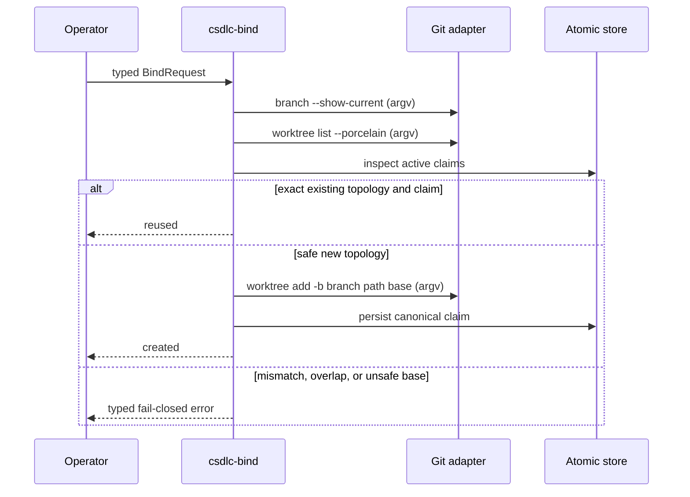
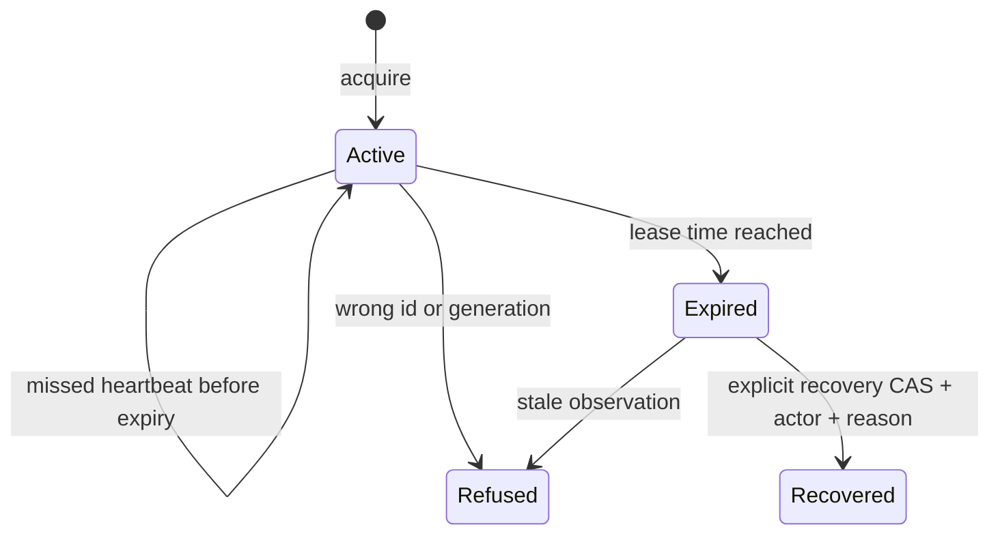

# Gate 3 sequence views

```mermaid
sequenceDiagram
  participant O as Operator
  participant B as csdlc-bind
  participant G as Git adapter
  participant S as Atomic store
  O->>B: typed BindRequest
  B->>G: branch --show-current (argv)
  B->>G: worktree list --porcelain (argv)
  B->>S: inspect active claims
  alt exact existing topology and claim
    B-->>O: reused
  else safe new topology
    B->>G: worktree add -b branch path base (argv)
    B->>S: persist canonical claim
    B-->>O: created
  else mismatch, overlap, or unsafe base
    B-->>O: typed fail-closed error
  end
```

```mermaid
stateDiagram-v2
  [*] --> Active: acquire
  Active --> Active: heartbeat CAS
  Active --> Refused: wrong id or generation
  Active --> Active: missed heartbeat before expiry
  Active --> Expired: lease time reached
  Expired --> Recovered: explicit recovery CAS + actor + reason
  Expired --> Refused: stale observation
```
