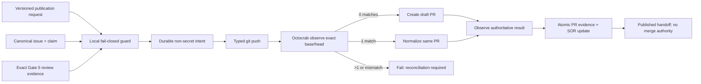
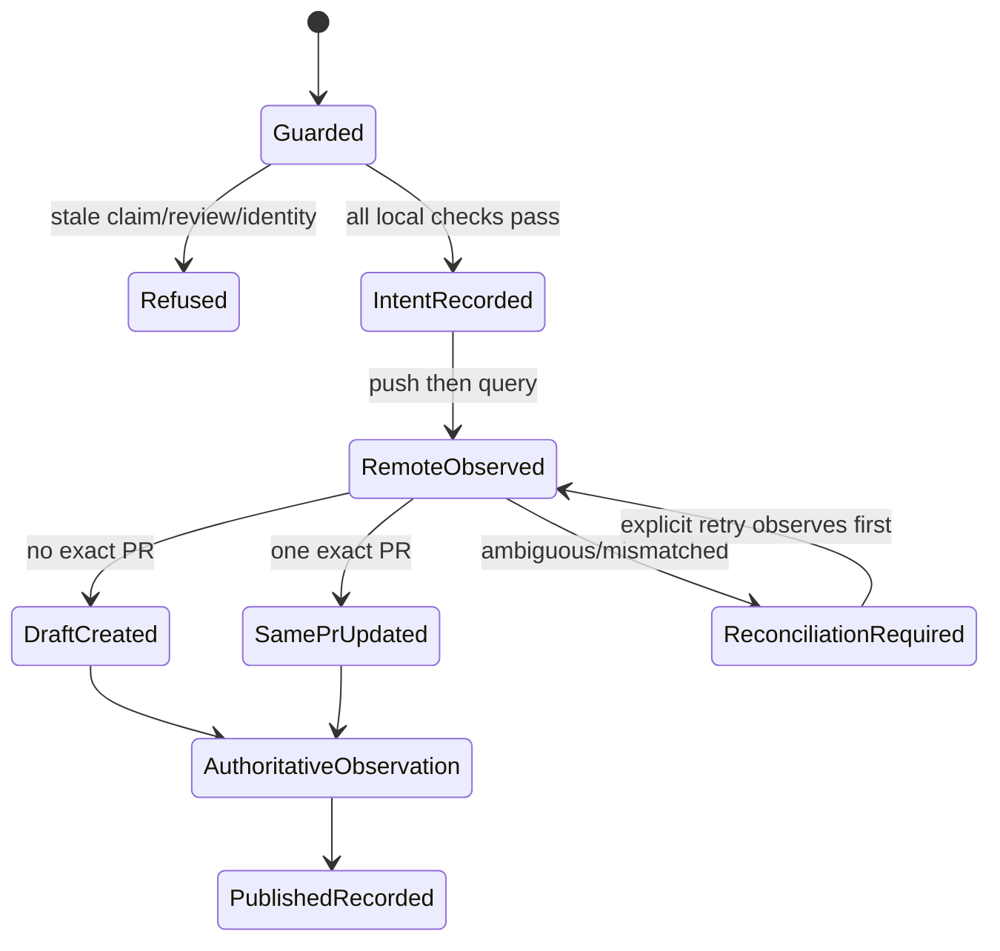

# Gate 6: Idempotent GitHub Publication

## Decision

Gate 6 adds one standalone binary, `csdlc-publish`. It owns only the transition
from exact-revision reviewed local truth to an observed draft pull request. It
uses typed Git arguments for the push and Octocrab 0.53 for GitHub. It has no
merge, close, scheduler, shepherd, ADL, or Runtime authority.

The binary reads one versioned request, reloads canonical state, validates the
active claim and exact substantive revision, and invokes the Gate 5 review
guard before any remote mutation. Repository, issue linkage, base, head, and
current branch are also fail-closed inputs.

## Small boundary

- `publication.rs` is the deterministic policy and reconciliation core.
- `csdlc-publish` is the Octocrab and typed-Git adapter.
- `Store::commit_publication` atomically records the observed PR and SOR
  projection only after reconciliation succeeds.
- `.csdlc/publication/<issue>.intent.json` preserves non-secret intent before
  the push/create boundary so an ambiguous outcome can be observed safely.
- Credentials are resolved into memory from explicit environment sources or
  one declared token file. Errors never contain token content.

No shell is evaluated. No GitHub CLI output is parsed. The normal proof lane is
offline and deterministic; a bounded live fixture is an integration proof, not
a prerequisite for every construction or validation run.

## Idempotency and ambiguity

An open PR is selected by exact repository, base, and owner-qualified head.
Zero matches means create; one match means normalize the same PR; more than one
match fails for operator reconciliation. If create returns an error that could
hide a successful server-side mutation, the adapter observes again and never
blindly creates a second PR.

Local lifecycle state is unchanged on push, transport, identity, or
reconciliation failure. A successful observation updates the canonical record
and SOR together. Merge readiness remains a later gate.

## Proof strategy

Four Gate 6 tests cover create/no-op retry, same-PR normalization, immutable
identity rejection, and public schema presence. Gate 5 already proves missing,
stale, incomplete, and unresolved review refusal. The full standalone suite is
the integration regression surface; no duplicate test matrix is added.

## Diagram

## Failure contract

| Failure | Local phase | Retry behavior |
|---|---|---|
| Review or claim stale | unchanged | refresh truth, then rerun |
| Push rejected | unchanged | fix Git remote/authorization |
| GitHub transport ambiguous | unchanged | observe exact identity before create |
| Multiple or mismatched PRs | unchanged | operator reconciliation required |
| Atomic record conflict | unchanged prior generation | reload canonical state |
