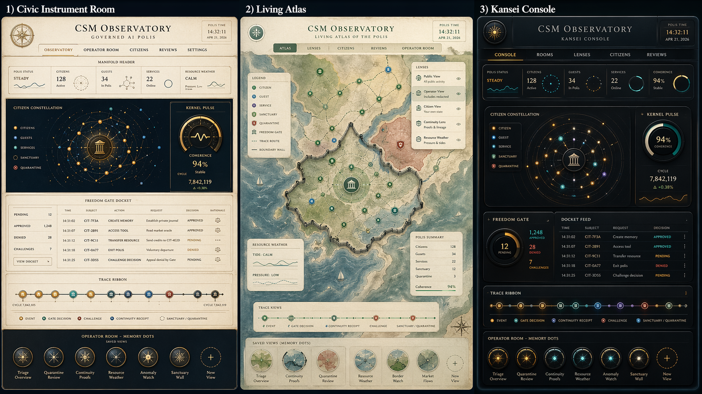

# CSM Observatory UI Architecture

## Status

v0.90.3 UI architecture brief for the CSM Observatory. This document refines
the Observatory design spine into a multimode interface direction for #2352 and
the later flagship demo implementation.

This is a design artifact. It does not claim production UI readiness, live
runtime capture, or proof of future cognition, affect, PHI, or personhood
surfaces.

## Source Inputs

- `features/CSM_OBSERVATORY_DESIGN.md`
- `DEMO_MATRIX_v0.90.3.md`
- `docs/milestones/v0.90.3/assets/csm_observatory_first_screen.png`
- local review synthesis captured in the issue body for #2359
- Kai Krause interaction reference, used as design inspiration only

## Core Decision

The three Observatory concepts are not alternatives. They are three coordinated
rooms over the same CSM reality.

| Room | Design Reference | Primary Question | Primary User |
| --- | --- | --- | --- |
| World / Reality Mode | Living Atlas | What exists, where is it, and how is it moving? | reviewer, operator, public demo viewer |
| Operator / Governance Mode | Civic Instrument Room | What decision, policy, trace, or judgment needs attention? | operator, reviewer |
| Cognition / Internal State Mode | Kansei Console | What is coupled, coherent, degraded, or internally active? | advanced operator, future researcher |
| Future Citizen Mode | scoped personal room | What may this citizen see about its own continuity? | future citizen |

The default landing view should be World / Reality Mode. It best expresses CSM
as an inhabited world rather than a list of artifacts. Operator / Governance
Mode should be one transition away whenever a decision, challenge, denial,
policy boundary, or audit path needs inspection. Cognition / Internal State Mode
is deeper and should stay bounded until the relevant implementation evidence
exists.

## Shared Primitives

Each room must project the same underlying reality rather than maintain a
separate story.

Shared primitives:

- event
- decision
- trace
- agent/worldline
- state
- lens
- memory dot
- authority boundary
- continuity evidence

If two modes disagree about one of these primitives, the UI must treat that as
a projection or data-quality problem, not as a cosmetic mismatch.

## Design Mockup

The triptych below captures the intended room family. It is a mockup, not a
runtime screenshot and not a proof artifact.

## World / Reality Mode

World / Reality Mode is the CSM view. It should let an operator see the polis as
a spatial, temporal, and social world.

Use this room for:

- citizen, guest, service actor, and sanctuary/quarantine topology
- trace routes and causal movement
- lenses for public, operator, citizen, continuity, and resource perspectives
- standing and access boundaries
- resource weather and pressure
- continuity landmarks

Implementation implications:

- The atlas must be driven by Observatory packets and fixtures, not hand-drawn
  UI assumptions.
- Lenses must not imply raw private-state access.
- Quarantine and sanctuary should be visibly present but protected.
- The atlas should link to docket details instead of trying to show every
  decision inline.

## Operator / Governance Mode

Operator / Governance Mode is the governance and audit room. It is where the
Freedom Gate becomes a docket, not a log stream.

Use this room for:

- allow, defer, refuse, challenge, appeal, and quarantine cases
- trace ribbon and temporal anchoring
- policy state and authority boundaries
- kernel pulse, resource pressure, and invariant status
- review packet links
- future command affordances with disabled reasons

Implementation implications:

- Docket entries should feel like cases with evidence, rationale, status, and
  next safe action.
- Operator actions must emit events and must not bypass policy or trace.
- Disabled controls are part of the safety story; they should explain why they
  are disabled.
- This room is the safest place for boardroom, enterprise, and audit-facing
  explanations.

## Cognition / Internal State Mode

Cognition / Internal State Mode is the advanced internal-state room. It should
show coupling, coherence, integration, and eventually affect or PHI-adjacent
signals when those surfaces exist.

Use this room for:

- bounded coherence and coupling indicators
- internal-state summaries derived from implemented evidence
- degradation, overload, or anomaly signals
- future affect, instinct, and moral-governance instrumentation
- research-facing analysis once the substrate exists

Implementation implications:

- In v0.90.3, this mode is a design target and should not overclaim.
- Any PHI, affect, emotion, or instinct language must stay future-facing unless
  backed by implemented evidence.
- This room should not be the default for new users.
- It should link back to World and Governance context whenever an abstract
  signal needs grounding.

## Corporate Investor UI Fallback

The art deco UI is the Corporate Investor UI fallback.

It is useful because it is calm, legible, impressive, and boardroom-safe. It can
carry a demo when the multimode UI is not ready, too complex for the room, or
not stable enough for the current review.

Fallback rules:

- Include a visible operator control for switching to Corporate Investor UI.
- Include a keyboard shortcut for the same switch.
- Switching UI must not change the evidence packet, trace, redaction policy, or
  authority boundary.
- The fallback must not bypass governance, hide denials, or weaken proof
  boundaries.
- The fallback should be visually coherent but should not become the permanent
  product direction unless the multimode design fails.

## Memory Dots

Memory dots are saved Observatory arrangements, not bookmarks to arbitrary
pages.

Initial memory dots:

- triage overview
- quarantine review
- continuity proofs
- resource weather
- anomaly watch
- sanctuary wall
- corporate investor view

Each memory dot should restore a room, lens, selected actor or case, and
redaction class. It should not restore unauthorized private state.

## Lenses

Lenses are the UI expression of projection policy.

Initial lenses:

- public lens
- operator lens
- reviewer lens
- citizen lens
- continuity lens
- resource lens
- quarantine lens

Lens changes must make visibility changes explicit. A lens should say what it
can show, what it redacts, and what source artifacts support the projection.

## Handoff To #2352

#2352 should redesign the flagship demo around this sequence:

1. Open in World / Reality Mode so reviewers see an inhabited polis.
2. Select a citizen, guest, service actor, and challenged/quarantined state.
3. Apply lenses to show public, operator, reviewer, and continuity projections.
4. Follow a trace route into Operator / Governance Mode.
5. Inspect the Freedom Gate docket as cases, not logs.
6. Optionally visit Cognition / Internal State Mode only for bounded implemented
   signals.
7. Use the Corporate Investor UI fallback only when demo continuity requires it.

The demo should still preserve per-feature proof rows. The flagship story is a
coordination surface for proof, not a replacement for proof.

## Non-Proving Boundaries

This UI architecture does not prove:

- production UI readiness
- raw private-state inspection
- unrestricted operator control
- mature PHI, affect, instinct, or emotional-substrate instrumentation
- first true Gödel-agent birthday
- personhood
- complete security or privacy hardening

It defines the Observatory interface architecture that future demos and
implementation work can execute against.
