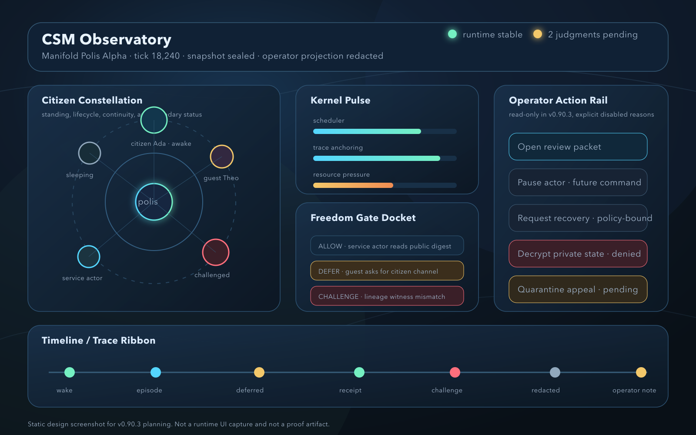
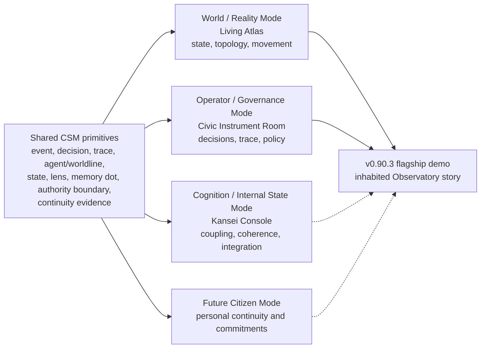
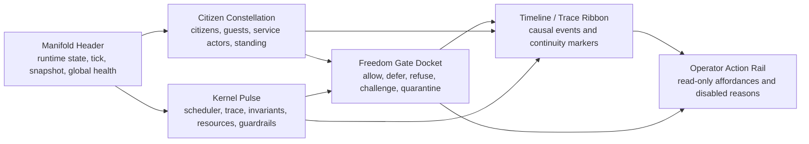
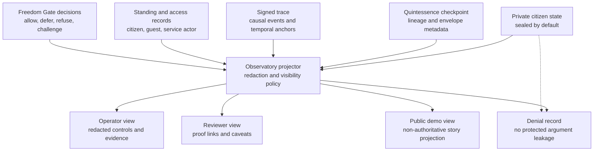

# CSM Observatory Design

## Status

v0.90.3 design surface for the CSM Observatory. This document promotes the
local Observatory planning note into the tracked milestone package so WP-14 and
WP-14A have a shared design spine.

The deeper UI architecture brief lives in
`../OBSERVATORY_UI_ARCHITECTURE_v0.90.3.md`.

## Purpose

CSM Observatory is the operator, reviewer, and eventually citizen-facing way to
see the CSM polis.

It is not a generic dashboard. It is a visibility platform for a living,
governed runtime: citizens, guests, service actors, episodes, continuity,
private state projections, Freedom Gate decisions, quarantine, resources,
trace, and operator judgment.

## North Star

An operator opens one surface and immediately understands:

- what manifold is running
- which citizens and guests are present
- which actors are awake, sleeping, paused, degraded, challenged, or quarantined
- what episodes are active or recently completed
- what the kernel is doing
- what continuity evidence exists
- what the Freedom Gate accepted, deferred, refused, or challenged
- what private state is protected
- what the Observatory can safely project
- what actions require human judgment

The surface should feel like a control room for a small governed world, not a
log viewer.

## Design Principle

Every visible element should answer one of three questions:

- What is alive?
- What is changing?
- What requires judgment?

If a panel does not answer one of those questions, it does not belong on the
first screen.

## Interaction Inspiration

The Observatory should borrow from the deeper lessons of Kai Krause's interface
language without copying its period surface treatment.

The useful pattern is the specialized room: a whole-screen environment built
for one kind of attention, where controls, mood, spatial layout, and feedback
all serve the task. For ADL, that means the Observatory should feel less like an
admin dashboard and more like a governed instrument room: calm by default,
alive under attention, and explicit about what is visible, sealed, deferred, or
dangerous.

Subtle inspirations to carry forward:

- rooms, not generic pages: World, Governance, Cognition, and future Citizen
  modes should each feel like purpose-built environments
- instruments, not widgets: the Freedom Gate docket, trace ribbon, kernel
  pulse, and citizen constellation should read as precise instruments
- progressive reveal: advanced controls can remain dimmed, folded, or
  unavailable until context makes them relevant
- memory dots: future saved views can preserve useful operator/reviewer
  arrangements such as triage, citizen continuity, quarantine review, proof
  packet, and resource weather
- lenses: redaction and projection can be represented as inspectable lenses
  over the polis, never as raw private-state access
- visible protection: sealed, private, challenged, and quarantined regions
  should remain visibly present while still protected

## Visual Assets

The design surface includes both diagram-as-code sources and a static
first-screen screenshot mockup.

| Artifact | Purpose | Status |
| --- | --- | --- |
| `../diagrams/csm_observatory_modes.mmd` | multimode Observatory architecture and shared primitives | source-backed Mermaid diagram |
| `../diagrams/csm_observatory_surface_map.mmd` | information architecture for the Observatory first screen | source-backed Mermaid diagram |
| `../diagrams/csm_observatory_projection_flow.mmd` | redacted projection and authority flow | source-backed Mermaid diagram |
| `../assets/csm_observatory_first_screen.svg` | durable vector mockup of the first screen | rendered locally |
| `../assets/csm_observatory_first_screen.png` | raster screenshot for review packets and surfaces that do not render SVG | rendered locally |
| `../assets/csm_observatory_multimode_ui_mockups.png` | triptych mockup for World, Governance, and Cognition rooms | design mockup |

The screenshot is a design mockup, not a runtime UI capture and not a proof
artifact.

## Audiences

| Audience | Primary Need | Visibility Boundary |
| --- | --- | --- |
| Operator | Understand state and decide safe next actions | Redacted projection plus authorized control affordances |
| Reviewer | Verify proof claims and non-proving boundaries | Evidence links, trace summaries, and caveats without raw private state |
| Citizen | Understand own continuity and commitments | Future per-citizen view, limited to that citizen's authorized surface |
| Public demo viewer | Understand the story of the CSM | Non-authoritative projections only |

## Modes

The Observatory should expose multiple coordinated rooms over the same CSM
reality, not three competing products or disconnected dashboards.

All modes share the same primitives:

- event
- decision
- trace
- agent/worldline
- state
- lens
- memory dot
- authority boundary
- continuity evidence

### World / Reality Mode

Default landing room. Shows the CSM as an inhabited world: citizens, guests,
service actors, topology, routes, boundaries, episodes, standing, and movement
through time. This is the best place to help a new operator or reviewer see the
polis as a world rather than as a table of artifacts.

Living Atlas is the design reference for this mode. It should use cartographic
and civic-map metaphors carefully: nodes as actors, regions as domains or
states, routes as trace and causality, lenses as perspective transforms, and
sanctuary/quarantine as visible boundaries.

### Operator / Governance Mode

Decision and audit room. Shows Freedom Gate decisions as dockets, trace as
ribbon, policy state, kernel pulse, resource pressure, evidence links, and
operator action affordances.

Civic Instrument Room is the design reference for this mode. It should make
ADL feel governable, auditable, and serious. Future bounded commands such as
pause, resume, request snapshot, annotate trace, request recovery, or open
review packet must emit operator events and must not bypass policy or trace.

### Cognition / Internal State Mode

Advanced analysis room. Shows integration, coupling, coherence, internal
state summaries, and eventually affect or PHI-adjacent measurements when those
surfaces exist.

Kansei Console is the design reference for this mode. In v0.90.3 it must remain
carefully bounded: it can define the intended room and visual vocabulary, but it
must not claim mature PHI, affect, instinct, or emotional-substrate
instrumentation before those features exist.

### Citizen Mode

Future focused view for one citizen. It should show identity, lifecycle,
memory handles, commitments, current episode, capability envelope, recent
decisions, and continuity proof only within authorized visibility.

These modes are rooms in the interaction sense. Switching mode should change
the task environment and visibility contract, not merely highlight a different
navigation item.

The existing art deco UI remains a fallback direction: useful if implementation
pressure requires a quick, coherent surface, but not the final target if the
multimode room architecture proves workable.

The fallback must be reachable quickly. The production design should include a
small operator-visible fallback control and a keyboard shortcut that switches
to the art deco UI without changing the underlying CSM evidence packet,
redaction policy, trace, or authority boundaries. The control is for demo
continuity and operational resilience, not for bypassing governance.

## Mode Architecture

## Minimum Visibility Packet

The Observatory should be driven by an explicit packet, not UI invention.

Required sections:

- manifold: identity, runtime state, tick, policy profile, snapshot status
- kernel: scheduler, trace, invariant, resource, and guardrail states
- actors: citizens, guests, service actors, and external actors
- episodes: active and recent episodes with proof surfaces
- continuity: witnesses, receipts, lineage, envelope, and checkpoint status
- standing: citizen/guest/service actor standing and communication boundary
- freedom_gate: allow, defer, refuse, challenge, and quarantine docket
- access: inspection, projection, decryption, wake, migration, challenge, and
  appeal denials or approvals
- resources: compute, memory, queue depth, scarcity events, and fairness notes
- trace: recent causal events and gaps
- operator_actions: available and disabled actions with safety reasons
- review: primary artifacts, missing artifacts, classification, and caveats

## Surface Map

## Projection Flow

## First Screen

The first screen should have six high-signal regions.

1. Manifold Header
   - world name, runtime state, current tick, snapshot status, global health

2. Citizen Constellation
   - visual map of citizens, guests, and service actors
   - state encoding for awake, sleeping, paused, degraded, blocked, challenged,
     or quarantined
   - should evolve toward the World / Reality Mode atlas

3. Kernel Pulse
   - scheduler, trace, snapshot, invariant, resource, and guardrail health

4. Freedom Gate Docket
   - recent allow/defer/refuse/challenge decisions
   - risky or rejected actions should be impossible to miss
   - belongs most strongly to Operator / Governance Mode

5. Timeline / Trace Ribbon
   - ordered recent events with causal links
   - distinguishes operator, kernel, citizen, guest, service actor, episode, and
     policy events

6. Operator Action Rail
   - read-only in v0.90.3
   - shows available future actions and why some are disabled
   - includes a clearly labeled art deco fallback switch when the multimode UI
     is unavailable, unstable, or inappropriate for the current demo/review

## Privacy And Redaction

The Observatory must never treat projection as authority.

Rules:

- raw private citizen state is not shown by default
- sealed checkpoints remain sealed
- receipts explain continuity without exposing unrelated private state
- operator view is redacted unless explicit policy grants more visibility
- reviewer view preserves evidence without exposing private state
- public/demo view is non-authoritative and aggressively redacted
- denial records must not leak protected arguments, private state, or hidden
  policy details
- every projection should identify its source artifacts and redaction class

## v0.90.3 Flagship Role

The v0.90.3 flagship demo should be an inhabited CSM Observatory scenario. It
should include:

- a citizen-like actor with continuity evidence
- a guest who cannot silently acquire citizen rights
- a service actor with explicit bounded authority
- an operator who can see redacted evidence and pending judgment
- a challenged or quarantined state when continuity or authority is ambiguous

The demo should show life in the walled town. It should not be an empty proof
packet.

## Visual Direction

Avoid generic dashboard cards.

The visual language should combine:

- chartroom
- constitutional court docket
- civic atlas
- instrument room
- runtime debugger
- social system monitor

Good motifs:

- atlas view of citizens, guests, service actors, routes, and boundaries
- timeline ribbon with causal markers
- invariant lights as status beacons
- Freedom Gate verdict cards
- resource pressure as weather or tide
- quarantine as visible but protected boundary
- redaction/projection lenses over protected state
- saved operator/reviewer views as memory dots
- cognition console for bounded integration/coherence surfaces
- quick fallback switch to the art deco UI for demo continuity

## Non-Proving Boundaries

v0.90.3 Observatory design does not prove:

- first true Gödel-agent birthday
- full personhood
- full moral/emotional substrate
- unrestricted operator control
- live mutation outside command packets and policy mediation
- production UI readiness
- production privacy/security hardening

It proves the intended visibility shape and gives WP-14/WP-14A a coherent
design target.
