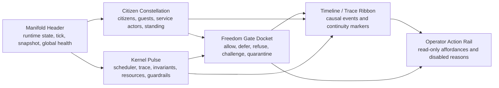
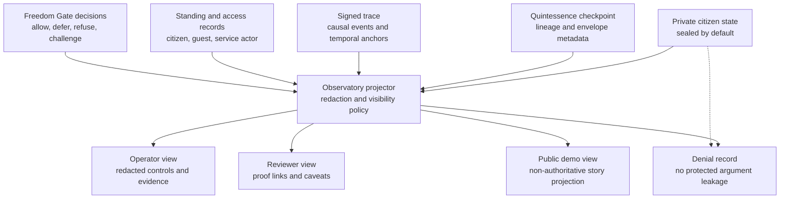

# CSM Observatory Design

## Status

v0.90.3 design surface for the CSM Observatory. This document promotes the
local Observatory planning note into the tracked milestone package so WP-14 and
WP-14A have a shared design spine.

## Purpose

CSM Observatory is the operator, reviewer, and eventually citizen-facing way to
see the CSM polis.

It is not a generic dashboard. It is a visibility platform for a living,
governed runtime: citizens, guests, service actors, episodes, continuity,
private state projections, Freedom Gate decisions, quarantine, resources,
trace, and operator judgment.

## North Star

An operator opens one surface and immediately understands:

- what manifold is running
- which citizens and guests are present
- which actors are awake, sleeping, paused, degraded, challenged, or quarantined
- what episodes are active or recently completed
- what the kernel is doing
- what continuity evidence exists
- what the Freedom Gate accepted, deferred, refused, or challenged
- what private state is protected
- what the Observatory can safely project
- what actions require human judgment

The surface should feel like a control room for a small governed world, not a
log viewer.

## Design Principle

Every visible element should answer one of three questions:

- What is alive?
- What is changing?
- What requires judgment?

If a panel does not answer one of those questions, it does not belong on the
first screen.

## Visual Assets

The design surface includes both diagram-as-code sources and a static
first-screen screenshot mockup.

| Artifact | Purpose | Status |
| --- | --- | --- |
| `../diagrams/csm_observatory_surface_map.mmd` | information architecture for the Observatory first screen | source-backed Mermaid diagram |
| `../diagrams/csm_observatory_projection_flow.mmd` | redacted projection and authority flow | source-backed Mermaid diagram |
| `../assets/csm_observatory_first_screen.svg` | durable vector mockup of the first screen | rendered locally |
| `../assets/csm_observatory_first_screen.png` | raster screenshot for review packets and surfaces that do not render SVG | rendered locally |

The screenshot is a design mockup, not a runtime UI capture and not a proof
artifact.

## Audiences

| Audience | Primary Need | Visibility Boundary |
| --- | --- | --- |
| Operator | Understand state and decide safe next actions | Redacted projection plus authorized control affordances |
| Reviewer | Verify proof claims and non-proving boundaries | Evidence links, trace summaries, and caveats without raw private state |
| Citizen | Understand own continuity and commitments | Future per-citizen view, limited to that citizen's authorized surface |
| Public demo viewer | Understand the story of the CSM | Non-authoritative projections only |

## Modes

### Observatory Mode

Read-only. Shows manifold state, citizens, episodes, trace, resources,
invariants, continuity, redacted projections, and review artifacts. This is the
safe v0.90.3 demo mode.

### Operator Mode

Future bounded command surface. Commands such as pause, resume, request
snapshot, annotate trace, request recovery, or open review packet must emit
operator events and must not bypass policy or trace.

### Citizen Mode

Future focused view for one citizen. It should show identity, lifecycle,
memory handles, commitments, current episode, capability envelope, recent
decisions, and continuity proof only within authorized visibility.

## Minimum Visibility Packet

The Observatory should be driven by an explicit packet, not UI invention.

Required sections:

- manifold: identity, runtime state, tick, policy profile, snapshot status
- kernel: scheduler, trace, invariant, resource, and guardrail states
- actors: citizens, guests, service actors, and external actors
- episodes: active and recent episodes with proof surfaces
- continuity: witnesses, receipts, lineage, envelope, and checkpoint status
- standing: citizen/guest/service actor standing and communication boundary
- freedom_gate: allow, defer, refuse, challenge, and quarantine docket
- access: inspection, projection, decryption, wake, migration, challenge, and
  appeal denials or approvals
- resources: compute, memory, queue depth, scarcity events, and fairness notes
- trace: recent causal events and gaps
- operator_actions: available and disabled actions with safety reasons
- review: primary artifacts, missing artifacts, classification, and caveats

## Surface Map

## Projection Flow

## First Screen

The first screen should have six high-signal regions.

1. Manifold Header
   - world name, runtime state, current tick, snapshot status, global health

2. Citizen Constellation
   - visual map of citizens, guests, and service actors
   - state encoding for awake, sleeping, paused, degraded, blocked, challenged,
     or quarantined

3. Kernel Pulse
   - scheduler, trace, snapshot, invariant, resource, and guardrail health

4. Freedom Gate Docket
   - recent allow/defer/refuse/challenge decisions
   - risky or rejected actions should be impossible to miss

5. Timeline / Trace Ribbon
   - ordered recent events with causal links
   - distinguishes operator, kernel, citizen, guest, service actor, episode, and
     policy events

6. Operator Action Rail
   - read-only in v0.90.3
   - shows available future actions and why some are disabled

## Privacy And Redaction

The Observatory must never treat projection as authority.

Rules:

- raw private citizen state is not shown by default
- sealed checkpoints remain sealed
- receipts explain continuity without exposing unrelated private state
- operator view is redacted unless explicit policy grants more visibility
- reviewer view preserves evidence without exposing private state
- public/demo view is non-authoritative and aggressively redacted
- denial records must not leak protected arguments, private state, or hidden
  policy details
- every projection should identify its source artifacts and redaction class

## v0.90.3 Flagship Role

The v0.90.3 flagship demo should be an inhabited CSM Observatory scenario. It
should include:

- a citizen-like actor with continuity evidence
- a guest who cannot silently acquire citizen rights
- a service actor with explicit bounded authority
- an operator who can see redacted evidence and pending judgment
- a challenged or quarantined state when continuity or authority is ambiguous

The demo should show life in the walled town. It should not be an empty proof
packet.

## Visual Direction

Avoid generic dashboard cards.

The visual language should combine:

- chartroom
- mission control
- constitutional court docket
- runtime debugger
- social system monitor

Good motifs:

- orbital citizen layout around the manifold
- timeline ribbon with causal markers
- invariant lights as status beacons
- Freedom Gate verdict cards
- resource pressure as weather or tide
- quarantine as visible but protected boundary

## Non-Proving Boundaries

v0.90.3 Observatory design does not prove:

- first true Gödel-agent birthday
- full personhood
- full moral/emotional substrate
- unrestricted operator control
- live mutation outside command packets and policy mediation
- production UI readiness
- production privacy/security hardening

It proves the intended visibility shape and gives WP-14/WP-14A a coherent
design target.
