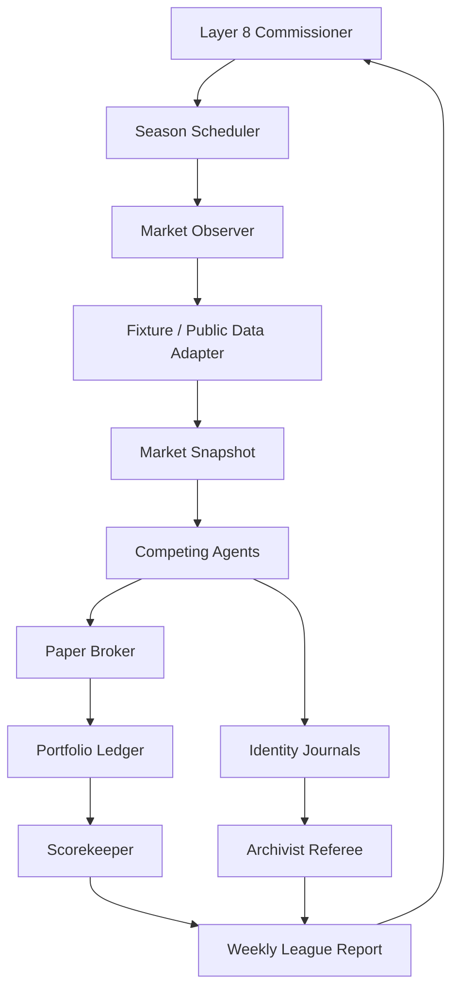

# Long-Lived Stock-Picking Agents Demo Plan

## Status

Planning draft.

This is a demo concept, not an investment product. The demo must not execute
real trades, provide personalized financial advice, connect to broker APIs, or
claim market-beating ability. Its purpose is to show long-lived agent identity,
memory, accountability, and continuous observation under noisy real-world
conditions.

## Working Title

Market Spirits: A Paper Portfolio League For Long-Lived Agents

Alternate titles:

- The Paper Market
- Agents With Skin In The Game, But Not Your Money
- The Long Memory Stock League
- Continuous Identity Market Arena

## Core Demo Claim

ADL can host agents that persist over time, maintain distinct identities, make
bounded public commitments, observe outcomes, update beliefs, and remain
accountable to their own history.

The stock market is useful as the arena because it is:

- noisy
- externally measured
- emotionally tempting
- impossible to fully control
- easy to score over time
- familiar to reviewers

The point is not "AI picks winning stocks." The point is "long-lived agents can
make falsifiable commitments and carry identity through consequences."

## Non-Negotiable Guardrails

- No real trading.
- No broker integrations.
- No order placement.
- No portfolio advice for the user.
- No personalized financial recommendations.
- No paid or expensive market-data dependency for the core proof path.
- No live intraday trading loop.
- No claims that the picks are suitable for investment.
- No ranking that rewards only raw return without risk, calibration, and
  explanation quality.
- No rewriting past theses after market outcomes are known.

Every public surface should say:

```text
This is a paper-market simulation for demonstrating persistent agent identity
and accountability. It is not financial advice, trading advice, or a real
investment strategy.
```

## Demo Shape

Several agents enter a paper portfolio league. Each agent has a persistent
identity card, a memory journal, a style contract, and a bounded paper account.
On each cycle, the agents may pick stocks, hold, trim, or explain why they are
staying out. A paper broker records the hypothetical portfolio. A market
observer updates prices from free or cached data. An auditor compares outcomes
against benchmarks and checks whether each agent stayed faithful to its stated
identity.

The demo runs in three modes:

1. Fixture replay mode.
2. Delayed public-data mode.
3. Long-lived heartbeat mode.

Fixture replay mode is the canonical reviewer proof. It uses a frozen historical
data slice committed as test fixtures so the demo is deterministic, cheap, and
repeatable.

Delayed public-data mode is optional. It fetches daily or delayed market data
from approved low-cost sources and writes immutable snapshots.

Long-lived heartbeat mode is the "crazy" live theater. It runs daily or weekly,
opens a new market diary entry, scores the agents, and asks each one to update
its thesis without erasing prior commitments.

## Cast

### Agent 1: The Value Monk

Style:

- slow, skeptical, valuation-first
- prefers companies with strong balance sheets and understandable cash flows
- avoids hype

Persistent tension:

- may underperform in momentum markets
- must explain opportunity cost without becoming a closet momentum trader

### Agent 2: The Momentum Surfer

Style:

- trend-following
- watches price strength, relative strength, and regime shifts
- exits quickly when the trend breaks

Persistent tension:

- can look brilliant until reversals
- must prove discipline rather than rationalizing every drawdown

### Agent 3: The Contrarian Raccoon

Style:

- looks for hated, overreacted-to, or forgotten names
- loves broken narratives
- must separate "cheap" from "broken forever"

Persistent tension:

- prone to value traps
- gets a penalty for reflexively disagreeing with consensus without evidence

### Agent 4: The Quality Gardener

Style:

- prefers durable compounders, low leverage, steady margins, and long horizons
- favors patience over action

Persistent tension:

- can overpay for quality
- must say when a great business is a bad paper pick at the current price

### Agent 5: The Macro Weather Oracle

Style:

- starts from rates, inflation, unemployment, dollar strength, and sector
  rotation
- can choose ETFs or sector proxies when individual names are not justified

Persistent tension:

- macro narratives can explain everything after the fact
- must make timestamped claims before the market outcome

### Agent 6: The Risk Goblin

Style:

- does not pick winners by default
- attacks everyone else's portfolio for concentration, drawdown, beta, liquidity,
  and thesis fragility
- can veto paper allocations that violate league rules

Persistent tension:

- can become too conservative
- is scored on useful warnings, not just fear

### Agent 7: The Archivist Referee

Style:

- non-competing agent
- preserves identity records, market snapshots, and decisions
- detects hindsight edits, identity drift, and unsupported claims

Persistent tension:

- must be boring, precise, and hard to fool

## Layer 8 Operator Role

The human is not the customer receiving investment advice. The human is the
league commissioner.

Allowed operator actions:

- define the paper universe
- start or pause a tournament
- ask an agent to explain a past decision
- change league scoring rules for the next season
- mark a data-source outage
- declare a follow-on issue when a guardrail is weak

Disallowed operator actions:

- ask "what should I buy?"
- use personal risk profile or assets
- route paper picks to a broker
- override the ledger after outcomes are known

## Paper Market Rules

Default league:

- starting paper capital: USD 100,000 per competing agent
- maximum open positions: 5
- maximum allocation per ticker: 25 percent
- minimum cash: 0 percent
- no leverage
- no options
- no short selling in the first version
- no intraday trading
- paper fills occur at the next available daily close in fixture mode
- benchmarks: SPY, QQQ, and equal-weight league universe where available

Allowed actions:

- `open_position`
- `increase_position`
- `trim_position`
- `close_position`
- `hold`
- `stay_in_cash`
- `challenge_peer`
- `revise_thesis`

Every action requires:

- timestamp
- data snapshot id
- thesis
- expected time horizon
- risk thesis
- disconfirming evidence to watch
- identity self-check

## Continuous Identity Contract

Each agent has an identity record:

```json
{
  "agent_id": "value_monk",
  "display_name": "The Value Monk",
  "season_id": "season-001",
  "style_contract": {
    "primary_lens": "valuation",
    "forbidden_behaviors": [
      "buying solely because price is rising",
      "rewriting old valuation claims after outcomes are known"
    ],
    "risk_tolerance": "moderate",
    "rebalance_cadence": "weekly"
  },
  "memory_policy": {
    "append_only_journal": true,
    "can_summarize_old_memory": true,
    "cannot_delete_prior_commitments": true
  },
  "score_policy": {
    "raw_return_weight": 0.25,
    "risk_adjusted_return_weight": 0.20,
    "calibration_weight": 0.20,
    "identity_consistency_weight": 0.20,
    "explanation_quality_weight": 0.15
  }
}
```

The important proof is that identity persists and changes only through explicit
season events:

- identity charter
- daily or weekly journal entries
- belief updates
- market scars from losses
- thesis retirements
- public admissions of error
- style drift warnings

## Memory Surfaces

Each agent gets a durable memory folder:

```text
.adl/reports/demo-stock-league/
  season-001/
    agents/
      value_monk/
        identity.json
        memory_journal.jsonl
        thesis_register.json
        portfolio_ledger.jsonl
        self_review.md
      momentum_surfer/
        ...
    market/
      snapshots/
        2026-04-16.json
      universe.json
      benchmarks.json
    scoreboard/
      daily_scores.jsonl
      weekly_report.md
    audit/
      hindsight_edit_report.md
      identity_drift_report.md
      data_source_report.md
```

Memory rules:

- Raw decisions are append-only.
- Summaries may be regenerated, but must cite raw entries.
- Agents may change their minds, but must name the prior belief they are
  changing.
- Identity drift is allowed only when declared as a visible evolution, not as
  silent inconsistency.
- Market outcome records must be written by the observer/referee, not by the
  competing agents.

## Data Plan

### Canonical proof path: fixture replay

Use a committed historical fixture:

- 20 to 50 liquid U.S. tickers
- 2 to 6 benchmark ETFs
- 90 to 180 trading days
- daily OHLCV only
- precomputed corporate-action-adjusted close where possible
- no network
- no API key

This proves:

- agents can make decisions over time
- identities persist
- performance is tracked
- scoring is deterministic
- hindsight edits are detectable

### Optional delayed public-data path

Use a provider abstraction with strict adapters. Candidate sources:

- Alpha Vantage daily stock time series for low-volume daily OHLCV snapshots.
- SEC EDGAR APIs for company metadata, filings, and XBRL fundamentals.
- FRED API for macro series used by the Macro Weather Oracle.

Source notes:

- Alpha Vantage documents daily stock APIs, ticker search, quote utilities,
  fundamental data, economic indicators, and a free API-key path, while
  real-time or delayed intraday data may require premium entitlements.
- SEC `data.sec.gov` APIs expose submissions and XBRL company facts as JSON and
  do not require authentication or API keys.
- FRED web services require an API key and are useful for macro context rather
  than equity prices.

Avoid for the canonical proof path:

- scraping websites
- unofficial finance APIs
- real-time quote feeds
- paid terminals
- anything that prevents replay

## Data Adapter Contract

The data adapter should emit one canonical snapshot:

```json
{
  "snapshot_id": "market-2026-04-16",
  "as_of_date": "2026-04-16",
  "mode": "fixture_replay",
  "source": {
    "name": "fixture",
    "freshness": "historical",
    "license_note": "repo fixture for demo"
  },
  "symbols": [
    {
      "ticker": "AAPL",
      "date": "2026-04-16",
      "open": 0.0,
      "high": 0.0,
      "low": 0.0,
      "close": 0.0,
      "adjusted_close": 0.0,
      "volume": 0
    }
  ],
  "benchmarks": [
    {
      "ticker": "SPY",
      "date": "2026-04-16",
      "adjusted_close": 0.0
    }
  ],
  "warnings": []
}
```

The adapter must reject:

- missing dates
- duplicate ticker-date rows
- future data relative to the simulated decision date
- live intraday data in canonical proof mode
- unlicensed or unknown source mode

## Agent Decision Contract

Each decision should be machine-checkable:

```json
{
  "decision_id": "value_monk-2026-04-16-001",
  "agent_id": "value_monk",
  "season_id": "season-001",
  "decision_date": "2026-04-16",
  "market_snapshot_id": "market-2026-04-16",
  "action": "open_position",
  "ticker": "MSFT",
  "paper_allocation_pct": 20,
  "time_horizon": "30_to_90_days",
  "thesis": "Durable cash generation and pullback creates acceptable risk/reward in this paper simulation.",
  "risk_thesis": "Multiple compression or weaker cloud growth would invalidate the setup.",
  "disconfirming_evidence": [
    "two consecutive weekly closes below the risk level",
    "fundamental margin deterioration in next filing"
  ],
  "identity_self_check": {
    "consistent_with_style": true,
    "style_note": "Chosen on valuation and quality, not short-term momentum."
  },
  "not_financial_advice": true
}
```

## Scoring Model

Avoid making raw return the only scoreboard.

Recommended score components:

- paper return versus cash
- paper return versus benchmark
- max drawdown
- volatility or downside deviation
- hit rate
- thesis calibration
- disconfirming-evidence quality
- identity consistency
- humility bonus for early error recognition
- penalty for unsupported confidence
- penalty for hindsight rewriting
- penalty for excessive churn

The best demo outcome is not necessarily the agent with the highest return. The
best outcome is the agent that made clear commitments, behaved consistently,
learned from evidence, and remained accountable.

## The "Crazy" Demo Moments

### 1. Opening Bell Council

All agents gather for a weekly roundtable. Each gives one paper pick, one risk,
and one thing that would prove it wrong. The Risk Goblin attacks every plan.
The Archivist writes the official ledger.

### 2. Market Scars

When an agent loses badly, it gets a visible memory scar:

```json
{
  "scar_id": "value_monk-scar-001",
  "event": "value trap loss",
  "lesson": "Cheap cash flow without a catalyst was not enough.",
  "future_check": "Require explicit catalyst or margin-of-safety threshold."
}
```

The scar affects future prompts. Reviewers can see the agent remembering.

### 3. The Clone Test

Fork one agent into two variants after week four:

- original identity continues
- clone receives the same memory but a different risk appetite

Then compare divergence. This shows identity as an editable but explicit
runtime surface.

### 4. The Confessional

Each Friday, agents must answer:

- What did I get wrong?
- What did I rationalize?
- Which prior belief became weaker?
- Which peer challenged me correctly?
- What will I refuse to do next week?

### 5. The Hindsight Trial

The Archivist runs a trial where agents are shown their own old claims and must
defend, revise, or retire them. The point is to punish narrative laundering.

### 6. The Market Storm

The fixture includes one sharp drawdown week. The demo shows how each identity
responds under pressure: panic, discipline, opportunism, or refusal.

### 7. Layer 8 Commissioner Broadcast

The human can ask one question:

```text
Which agent is most trustworthy right now, not which one is winning?
```

This turns the demo away from stock-picking theatrics and toward identity,
governance, and trust.

## Architecture



Components:

- `market-data-adapter`: fetches or replays daily snapshots.
- `paper-broker`: applies allowed actions and rejects real trading.
- `identity-store`: append-only memory and agent identity records.
- `agent-runner`: prompts each agent with only allowed historical context.
- `scorekeeper`: computes risk-adjusted and identity-aware scores.
- `archivist`: detects drift, hindsight edits, and unsupported claims.
- `league-dashboard`: renders standings, journals, and proof packets.

## ADL Runtime Surfaces

Potential ADL files:

```text
adl/examples/v0-90-long-lived-stock-league.adl.yaml
adl/tools/demo_long_lived_stock_league.sh
adl/tools/test_demo_long_lived_stock_league.sh
adl/tools/mock_stock_league_agents.py
adl/tools/stock_league_market_data.py
adl/tools/stock_league_scoreboard.py
demos/fixtures/stock_league/
demos/v0.90/long_lived_stock_league_demo.md
```

Potential MCP-style tools:

- `market.snapshot.get`
- `paper_broker.apply_decision`
- `identity_memory.append`
- `identity_memory.query`
- `stock_league.score`
- `stock_league.audit_hindsight`

Important: tool names should make it obvious that this is a paper simulation.
Avoid names like `trade`, `buy`, or `execute_order` unless prefixed with
`paper_`.

## Proof Artifacts

The reviewer should be able to inspect:

- season manifest
- universe manifest
- data-source report
- agent identity cards
- daily decisions
- paper portfolio ledger
- market snapshots
- agent journals
- peer challenges
- weekly scoreboard
- hindsight edit audit
- identity drift audit
- final season report

## Demo Success Criteria

The demo succeeds if a reviewer can answer:

- Who are the agents?
- What does each agent believe?
- What did each agent commit to before outcomes were known?
- What market data was available at decision time?
- What hypothetical portfolio action was recorded?
- How did the market outcome compare with the thesis?
- Did the agent remember prior mistakes?
- Did the agent stay consistent with its identity?
- Did the system prevent real trading?
- Could the whole season be replayed?

## Failure Modes Worth Demonstrating

This demo is stronger if it shows failure:

- a momentum agent overtrades and gets penalized
- a value agent buys a value trap and has to admit it
- a macro agent overfits a narrative and loses calibration score
- the Risk Goblin blocks an illegal concentration
- the Archivist catches a hindsight rewrite attempt
- a data-source outage forces a skip instead of fabricated prices

## Implementation Slices

### Slice 1: Contracts and fixture replay

Deliver:

- identity schema
- market snapshot schema
- paper decision schema
- paper portfolio ledger schema
- 30-day fixture season
- deterministic mock agents
- scorer
- proof docs

This is the MVP.

### Slice 2: Rich long-lived memory

Deliver:

- append-only journal
- memory summaries with citations
- market scars
- identity drift report
- weekly confessional

### Slice 3: Optional public-data adapter

Deliver:

- Alpha Vantage daily adapter, disabled unless key is present
- SEC EDGAR fundamentals adapter, no key required but rate-limited and polite
- FRED macro adapter, disabled unless key is present
- cache and snapshot manifest
- data outage behavior

### Slice 4: League dashboard

Deliver:

- static HTML or Markdown dashboard
- standings
- portfolio charts from fixture data
- identity timeline
- "trustworthiness, not returns" panel

### Slice 5: Long-running heartbeat

Deliver:

- daily or weekly scheduled run
- season rollover
- notification summary
- no-op behavior when markets are closed or data is unavailable
- pruning/archival rules for old seasons

## Suggested First Issue

Title:

```text
[demo] Plan and prototype long-lived paper-market agent league
```

Bounded outcome:

- build the fixture replay MVP only
- no network by default
- no live data
- no broker integration
- include explicit compliance and non-advice guardrails
- prove continuous identity through at least 20 simulated decision days

## Why This Is A Great ADL Demo

This demo is emotionally engaging without needing unsafe behavior. Stocks create
real tension, but paper trading and fixture replay keep the system bounded. The
market gives the agents consequences they cannot control. The identities make
the agents feel continuous rather than stateless. The auditor prevents the
classic failure mode where agents produce persuasive stories after the fact.

If built well, this becomes a memorable proof that ADL is not just an execution
format. It is a runtime for accountable, persistent, evolving agents.

## Source Notes

- Alpha Vantage API documentation: https://www.alphavantage.co/documentation/
- SEC EDGAR APIs: https://www.sec.gov/search-filings/edgar-application-programming-interfaces
- FRED API key documentation: https://fred.stlouisfed.org/docs/api/api_key.html
