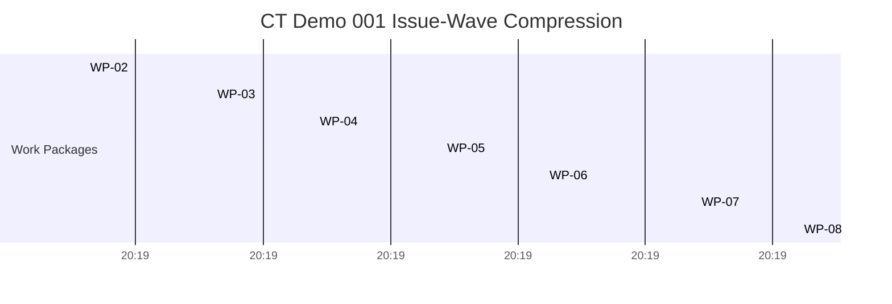

# CT Demo 001 First Proof Report

## Demo Identity

- transition id: `cts.v0_91_3.issue_3200.ct_demo_001`
- milestone version: `v0.91.3`
- demo command: `python3 adl/tools/demo_v0913_first_proof_demo.py --timeline docs/milestones/v0.91.3/review/first_proof_demo/ct_demo_001_timeline_snapshot.json --out docs/milestones/v0.91.3/review/first_proof_demo`
- C-SDLC first-proof classification: `proving`
- literal five-minute target classification: `non_proving`

## Executive Verdict

`WP-09` proves that the first bounded C-SDLC transition worked as a governed
end-to-end process: the manifest, public lifecycle bundle, DAG/shard plan,
evidence bundle, merge-readiness gate, and ObsMem handoff all converged into
one measurable proof surface. It does **not** prove the literal five-minute
target yet.

## Key Metrics

- baseline sequential estimate: `2228.71` minutes
- actual transition elapsed time: `413.32` minutes
- review-ready time: `412.48` minutes
- overlap reduction: `1815.39` minutes
- realized serial fraction upper bound: `0.1855`
- realized parallelizable fraction lower bound: `0.8145`
- shard count: `2`
- synchronization barriers: `3`

## Supporting Proof Checks

- merge gate outcome: `merge_ready`
- merge gate decision: `merge_ready`
- merge gate PR state: `MERGED`
- merge gate checks success: `True`
- merge gate zero open findings: `True`
- readiness outcome: `ready_for_wp09`
- ObsMem source PR state: `merged`
- ObsMem integration state: `merged`
- ObsMem closeout state: `closed_out`
- evidence bundle proving disposition present: `True`
- evidence bundle deferred disposition present: `True`

## Transition Timeline

## Per-WP Timing

| WP | Issue | PR | Issue -> PR (min) | PR cycle (min) | Issue -> Merge (min) |
| --- | --- | --- | ---: | ---: | ---: |
| WP-02 | [#3200](https://github.com/danielbaustin/agent-design-language/issues/3200) | [#3235](https://github.com/danielbaustin/agent-design-language/pull/3235) | 185.98 | 25.23 | 211.22 |
| WP-03 | [#3201](https://github.com/danielbaustin/agent-design-language/issues/3201) | [#3236](https://github.com/danielbaustin/agent-design-language/pull/3236) | 225.53 | 32.12 | 257.65 |
| WP-04 | [#3202](https://github.com/danielbaustin/agent-design-language/issues/3202) | [#3239](https://github.com/danielbaustin/agent-design-language/pull/3239) | 268.93 | 11.8 | 280.73 |
| WP-05 | [#3203](https://github.com/danielbaustin/agent-design-language/issues/3203) | [#3243](https://github.com/danielbaustin/agent-design-language/pull/3243) | 327.0 | 4.43 | 331.43 |
| WP-06 | [#3204](https://github.com/danielbaustin/agent-design-language/issues/3204) | [#3244](https://github.com/danielbaustin/agent-design-language/pull/3244) | 341.35 | 5.6 | 346.95 |
| WP-07 | [#3205](https://github.com/danielbaustin/agent-design-language/issues/3205) | [#3247](https://github.com/danielbaustin/agent-design-language/pull/3247) | 382.93 | 4.95 | 387.88 |
| WP-08 | [#3206](https://github.com/danielbaustin/agent-design-language/issues/3206) | [#3249](https://github.com/danielbaustin/agent-design-language/pull/3249) | 412.02 | 0.83 | 412.85 |

## Coordination And Governance Interpretation

- The observed issue-wave compression is real: `413.32`
  minutes elapsed versus a `2228.71`-minute
  sequential estimate derived from the same WP windows.
- The proof topology stayed bounded at `2` shards,
  `3` explicit barriers, and
  `5` serial coordination nodes.
- Merge-readiness and ObsMem handoff were present as tracked proof surfaces before
  this demo classified the transition as proving.

## Proof Classification

| Claim | Classification | Reason |
| --- | --- | --- |
| C-SDLC first bounded proof works | `proving` | The full upstream proof chain converged into one measurable, governance-preserving transition packet. |
| Literal five-minute target achieved | `non_proving` | The measured elapsed time is `413.32` minutes, so this remains a future repeatability target. |
| Governance preserved during compression | `proving` | Review, merge-readiness, and closeout truth all remained tracked and reviewable. |
| Evidence and memory chain converged | `proving` | Evidence bundle, merge gate, and ObsMem handoff are all present in tracked repo-relative form. |

## Tracked References

- `docs/milestones/v0.91.3/review/transition_manifest/fixtures/valid_cognitive_transition_manifest_v1.json`
- `workflow/c-sdlc/v0.91.3/issues/issue-3201-card-lifecycle-demo/README.md`
- `docs/milestones/v0.91.3/review/transition_dag/ct_demo_001_transition_dag.md`
- `docs/milestones/v0.91.3/review/transition_dag/ct_demo_001_shard_plan.md`
- `docs/milestones/v0.91.3/review/evidence_bundle/ct_demo_001_evidence_bundle.md`
- `docs/milestones/v0.91.3/review/evidence_bundle/ct_demo_001_review_synthesis.md`
- `docs/milestones/v0.91.3/review/merge_readiness/ct_demo_001_merge_gate.md`
- `docs/milestones/v0.91.3/review/obsmem_handoff/ct_demo_001_obsmem_handoff.md`
- `docs/milestones/v0.91.3/review/obsmem_handoff/ct_demo_001_obsmem_handoff.json`
- `docs/milestones/v0.91.3/review/first_proof_readiness/FIRST_PROOF_READINESS_PACKET_v0.91.3.md`
- `docs/milestones/v0.91.3/review/first_proof_readiness/ct_demo_001_first_proof_readiness.md`

## Non-Claims

- This packet does not claim literal five-minute execution success unless the measured elapsed time is five minutes or less.
- This packet does not claim live ObsMem ingestion or signed-trace verification.
- This packet does not claim unrestricted autonomous engineering or bypass of human review.
