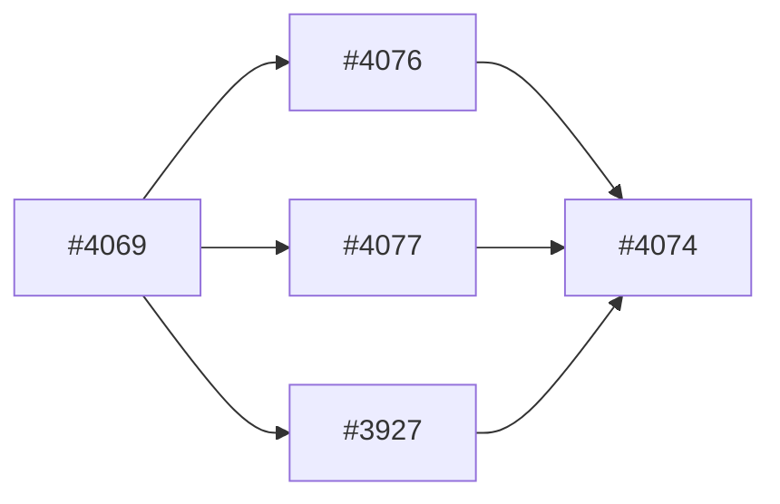

# V0916 Agent-Per-Task Sprint Conductor Simulation Proof Packet

## Metadata

- Sprint issue: `#4074`
- Sprint title: `[v0.91.6][SEP][local-agents] Test agent-per-task sprint conductor simulation`
- Milestone: `v0.91.6`
- Execution mode: `simulation_with_actual_delegated_tasks`
- Owner: `Codex`
- Last updated: `2026-06-19`

## Sprint Goal

Prove one bounded SEP execution slice where a main conductor delegates
watcher-style and review-style child tasks to separate agents, records watcher
events and conductor reconciliation in a durable sprint activity log, and keeps
all delegated output explicitly advisory rather than authoritative.

## Sprint Boundary

In scope:

- produce one small agent-per-task sprint simulation packet with 3-5 child roles
- record actual delegated task output, watcher events, validation truth, and non-claims

Out of scope:

- granting local models or subagents repository mutation authority
- claiming production-ready autonomous sprint execution from a single bounded proof

## Child Issue Wave

| Issue | Role | Status | Primary surface | Notes |
|---|---|---|---|---|
| `#4069` | sprint umbrella / inventory anchor | open | `docs/milestones/v0.91.6/review/sprint_execution_packets/V0916_SEP_LOCAL_AGENT_ACCELERATION_MINI_SPRINT_4069.md` | remains open until the mini-sprint finishes |
| `#4076` | readiness sweep | closed_after_merge | sprint-conductor readiness helpers | prerequisite landed before this proof |
| `#4077` | deterministic closeout | closed_after_merge | sprint-conductor closeout helpers | prerequisite landed before this proof |
| `#3927` | sprint review skill | closed_after_merge | `adl/tools/skills/sprint-review/` | merged immediately before this proof and watcher-observed |
| `#4074` | simulation proof | active_issue | sprint packet + activity log + lifecycle cards | current issue |

## Dependency Graph



## Recommended Execution Order

1. Land the setup/contract children: `#4076`, `#4077`, and `#3927`.
2. Bind `#4074` only after those children are merged and closeouted.
3. Use `#4074` to prove delegated watcher/reviewer roles plus main-conductor reconciliation.

## Issue Lifecycle Policy

- Delegated child roles in this proof are advisory only and cannot mutate repo state.
- The main conductor remains responsible for routing, validation, merge, and closeout truth.
- Completed child issues must still be fully closeouted before the umbrella closes.

## Watcher Policy

- Every active child issue or PR wait state must have a watcher result or explicit conductor poll.
- Watchers may emit only `ready`, `pending`, `blocked`, or `action_required`.
- Wait states without a watcher or conductor poll are invalid sprint state.

## Safe Parallel Lanes

| Lane | Issues | Why parallel-safe | Required coordination |
|---|---|---|---|
| delegated advisory lane | `watcher`, `issue-state summarizer`, `docs/review summarizer` | read-only tasks over existing packet and issue truth | main conductor verifies all output before acting |
| conductor control lane | `#4074` lifecycle, validation, PR publication, closeout | only the main conductor mutates tracked state | delegated lanes must stop short of mutation or approval |

## Serial Gates

| Gate | Blocks | Exit condition | Owner |
|---|---|---|---|
| prerequisite child gate | `#4074` execution | `#4076`, `#4077`, and `#3927` merged and closeouted | main conductor |
| advisory-verification gate | routing/closeout decisions | delegated watcher or reviewer output verified against live state | main conductor |

## PVF / Validation-Tail Notes

- Immediate issue-local proof: docs and lifecycle-card proof only for this packet/log slice
- Parallel validation lanes: none; this issue is a bounded docs/control-plane proof packet
- Serial validation gates: packet write, card truth update, bounded review
- Reusable proof criteria: delegated output must be explicitly labeled advisory and evidence-bound
- Fail-closed rule: if delegated output and live truth disagree, live truth wins and the disagreement is recorded

## Sprint Activity Log

- Log artifact path: `docs/milestones/v0.91.6/review/sprint_execution_packets/V0916_AGENT_PER_TASK_SPRINT_CONDUCTOR_SIMULATION_ACTIVITY_LOG_4074.md`
- Required events recorded:
  - prerequisite merge
  - issue bind
  - queue override
  - delegated task start
  - delegated task result
  - conductor reconciliation
- Log policy: record real delegated outputs and conductor dispositions separately

## Sprint-Level Review

- Sprint review artifact: this packet plus issue-local `SRP`
- Review scope:
  - actual delegated-task outputs
  - watcher disagreement and reconciliation
  - lifecycle-card truth
  - advisory-vs-authoritative boundary

## Subagent / Local Model Policy

- Actual delegated workers used in this issue:
  - Codex subagent `Bohr` as watcher-style classifier
  - Codex subagent `Darwin` as review/role summarizer
- Simulated local-model candidates reused from `#4069` inventory:
  - `gemma:2b` for tiny watcher/status classification fallback
  - `qwen3.6:27b` for slower card validation / summarization
  - `deepseek-r1:8b` as a bounded watcher candidate pending latency improvement
  - `gemma4:26b` or `Qwen3.5:35b-a3b` for docs/review-shaped bounded support
- Delegated roles proven or exercised here:
  - `watcher`
  - `issue-state summarizer`
  - `card validator` as a role fit, not an executed mutation path
  - `closeout checker` as a role fit, not an executed mutation path
  - `docs lint reviewer` / `activity-log summarizer`

## Template/AST Policy

- This proof packet is a temporary tracked Markdown artifact.
- It does not claim SEP packets are already maintained through markdown.rs or AST-backed editing.
- The markdown.rs / AST migration remains routed implementation work outside this issue.

## Shared Inputs And Artifacts

- shared source docs:
  - `docs/templates/sprints/current.json`
  - `docs/templates/sprints/1.0.0/sprint_execution_packet.md`
  - `adl/tools/skills/sprint-conductor/SKILL.md`
- shared sprint packet:
  - `docs/milestones/v0.91.6/review/sprint_execution_packets/V0916_SEP_LOCAL_AGENT_ACCELERATION_MINI_SPRINT_4069.md`
- shared activity artifact:
  - `docs/milestones/v0.91.6/review/sprint_execution_packets/V0916_AGENT_PER_TASK_SPRINT_CONDUCTOR_SIMULATION_ACTIVITY_LOG_4074.md`

## Cross-Sprint Dependencies

- upstream dependency: `#4069` inventory and umbrella packet
- downstream consumer: `#4069` closeout and future watcher-at-every-step / sprint-log automation
- collision risk: stale umbrella packet truth can conservatively underreport child readiness
- routing rule: record this as a sprint-truth maintenance observation, not as implicit permission for delegated automation

## Review Bar

- Review scope: packet truth, activity log truth, lifecycle-card truth, and advisory-output boundaries
- Required review skills: bounded pre-PR review subagent
- Code-facing review required: no, unless this issue widens beyond docs/control-plane packet work
- Docs-facing review required: yes
- Security review required: no additional security lane beyond normal truth/privacy checks

## Closeout Bar

- `#4074` must leave:
  - this proof packet
  - the activity log
  - truthful `SRP` and `SOR`
  - explicit distinction between actual delegated work and simulated local-model mapping
- The umbrella `#4069` must remain open until this issue is merged and closeouted.

## Residual Routing Policy

- Must-fix-before-sprint-close:
  - update `#4069` closeout truth so the umbrella packet no longer shows stale child state
- Post-sprint follow-ons:
  - watcher-at-every-step automation
  - AST-backed SEP editing
  - stronger local-model proof for larger/slow watcher candidates
- Deferred work:
  - any claim of authoritative local-model mutation or review authority
- Explicit non-blockers:
  - the delegated watcher reported `pending` from stale umbrella truth; that disagreement is useful proof, not a blocker

## Actual Delegated Task Outputs

### Delegated watcher result: `Bohr`

```yaml
target: "#4074 readiness to start now"
status: "pending"
evidence:
  - "SEP `V0916_SEP_LOCAL_AGENT_ACCELERATION_MINI_SPRINT_4069.md` marks `#4074` as `pending` in the child wave."
  - "The SEP's recommended execution order places `#4074` after `#4069`, `#4076`, `#4077`, and `#3927`."
  - "The SEP's serial gates still describe `#4069` and `#4076` as unresolved prerequisites."
next_action: "Keep `#4074` watcher-owned until prerequisite truth is rechecked."
confidence: "high"
```

Conductor disposition:
- accepted as a valid advisory watcher result
- not accepted as final routing authority because the umbrella packet lagged live child issue truth
- reconciled against live evidence showing `#4076`, `#4077`, and `#3927` already merged and closeouted

### Delegated reviewer/summarizer result: `Darwin`

Recommended bounded roles:
1. `watcher`
2. `issue-state summarizer`
3. `card validator`
4. `closeout checker`
5. `docs lint reviewer` or `activity-log summarizer`

Required non-claims preserved:
- local agents are not autonomous implementers
- local agents are not authoritative reviewers
- advisory watcher output must be verified by the main conductor
- fast watcher-loop reliability is not proven for larger local models
- the simulation does not imply multi-agent mutation authority or automated sprint-state advancement

## Recommendation

This issue proves a narrow but real claim:
- an agent-per-task sprint simulation is useful when delegated roles are
  bounded, advisory, and verified by the main conductor

It does not prove:
- production-ready autonomous sprint execution
- authoritative local-model watcher or closeout behavior
- removal of the conductor’s responsibility to reconcile stale packet truth

Recommended posture:
- `useful_with_limits` for delegated watcher/summarizer support
- `not_ready_for_authority` for autonomous routing, mutation, review approval,
  or closeout decisions

## Non-Claims

- This packet does not claim local models can execute or merge issues autonomously.
- This packet does not claim delegated watcher output is authoritative without conductor verification.
