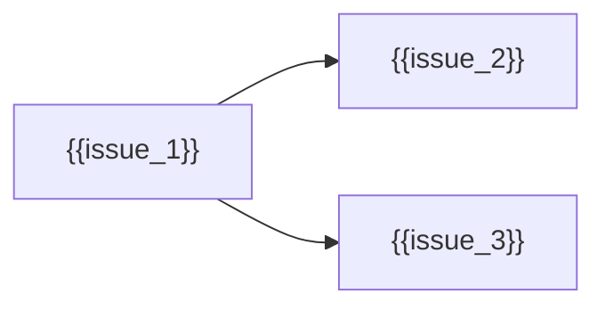

# Sprint Execution Packet Template

## Metadata

- Sprint issue: `{{sprint_issue}}`
- Sprint title: `{{sprint_title}}`
- Milestone: `{{milestone}}`
- Execution mode: `{{execution_mode}}`
- Owner: `{{owner}}`
- Last updated: `{{last_updated}}`

Allowed `execution_mode` values:

- `sequential`: one child issue executes at a time because every child depends
  on the previous closeout.
- `parallel`: multiple child issues may execute at once because write sets,
  proof lanes, and review surfaces are intentionally independent.
- `hybrid`: some child issues may execute in parallel, but named serial gates
  must close before later lanes begin.

## Sprint Goal

{{sprint_goal}}

## Sprint Boundary

In scope:

- {{in_scope_1}}
- {{in_scope_2}}

Out of scope:

- {{out_of_scope_1}}
- {{out_of_scope_2}}

## Child Issue Wave

| Issue | Role | Status | Primary surface | Notes |
|---|---|---|---|---|
| {{issue_1}} | {{role_1}} | {{status_1}} | {{surface_1}} | {{notes_1}} |
| {{issue_2}} | {{role_2}} | {{status_2}} | {{surface_2}} | {{notes_2}} |
| {{issue_3}} | {{role_3}} | {{status_3}} | {{surface_3}} | {{notes_3}} |

## Dependency Graph

## Recommended Execution Order

1. {{execution_step_1}}
2. {{execution_step_2}}
3. {{execution_step_3}}

## Issue Lifecycle Policy

- Each child issue must end in one explicit terminal state: `closed_after_merge`,
  `closed_no_merge`, `deferred_with_route`, or `failed_with_route`.
- Completed child issues must be closed as soon as final review, PR outcome,
  closeout, and worktree pruning are complete.
- Do not leave completed issues open as ambient state for later sessions to
  interpret.
- Each child issue closeout should be owned by an explicit closeout agent or
  closeout handoff.

## Watcher Policy

- Every active child issue must have a watcher or equivalent lifecycle monitor
  for its current state: card readiness, implementation, PR checks, review,
  merge, closeout, and worktree pruning.
- Watchers must report `complete`, `failed`, `blocked`, or `waiting_with_next_check`.
- Wait states without a watcher are not valid sprint state.

## Safe Parallel Lanes

| Lane | Issues | Why parallel-safe | Required coordination |
|---|---|---|---|
| {{lane_1}} | {{lane_1_issues}} | {{lane_1_safety}} | {{lane_1_coordination}} |
| {{lane_2}} | {{lane_2_issues}} | {{lane_2_safety}} | {{lane_2_coordination}} |

## Serial Gates

| Gate | Blocks | Exit condition | Owner |
|---|---|---|---|
| {{gate_1}} | {{blocked_work_1}} | {{exit_condition_1}} | {{gate_owner_1}} |
| {{gate_2}} | {{blocked_work_2}} | {{exit_condition_2}} | {{gate_owner_2}} |

## PVF / Validation-Tail Notes

- Immediate issue-local proof: {{issue_local_proof}}
- Parallel validation lanes: {{parallel_validation_lanes}}
- Serial validation gates: {{serial_validation_gates}}
- Reusable proof criteria: {{proof_reuse_criteria}}
- Fail-closed rule: {{fail_closed_rule}}

## Sprint Activity Log

- Log artifact path: `{{sprint_activity_log}}`
- Required events: issue start, card repair, worktree bind, PR publication,
  watcher state, validation result, review result, merge/closeout, and
  worktree prune.
- Log policy: `{{sprint_log_policy}}`

## Sprint-Level Review

- Sprint review artifact: `{{sprint_review_artifact}}`
- Review scope: child issues, PRs, changed files, logs, validation proof,
  closeout truth, residual routing, and failed/deferred lanes.
- All actionable sprint-level findings must be fixed, routed, or explicitly
  accepted before the sprint umbrella closes.

## Subagent / Local Model Policy

- Subagent strategy: `{{subagent_strategy}}`
- Local model candidates: `{{local_model_candidates}}`
- Simple delegated roles: watcher, card validator, docs lint reviewer,
  closeout checker, issue-state summarizer.
- Local agents must produce bounded, reviewable output and must not mutate repo
  state unless an issue explicitly grants that authority.

## Template/AST Policy

- SEP templates should be maintained through the same AST-backed template path
  as other C-SDLC templates once the markdown.rs editor lane is available.
- Direct Markdown edits are acceptable only as a temporary bootstrap surface
  until the AST-backed SEP renderer is implemented and proven.

## Shared Inputs And Artifacts

- Shared source docs: {{shared_source_docs}}
- Shared code surfaces: {{shared_code_surfaces}}
- Shared review packets: {{shared_review_packets}}
- Shared logs or observability surfaces: {{shared_logs}}

## Cross-Sprint Dependencies

- Upstream dependencies: {{upstream_dependencies}}
- Downstream consumers: {{downstream_consumers}}
- Collision risks: {{collision_risks}}
- Routing rule: {{routing_rule}}

## Review Bar

- Review scope: {{review_scope}}
- Required review skills: {{required_review_skills}}
- Code-facing review required: {{code_review_required}}
- Docs-facing review required: {{docs_review_required}}
- Security review required: {{security_review_required}}

## Closeout Bar

- Every child issue is closed or explicitly deferred with rationale.
- Every child PR is merged, closed without merge, or routed with truthful state.
- Sprint review findings are either fixed, routed, or recorded as residual risk.
- Sprint closeout artifact records child issue status, PR URLs, proof surfaces,
  validation state, and follow-up routing.
- Worktrees are pruned or retained with an explicit reason.

## Residual Routing Policy

- Must-fix-before-sprint-close: {{must_fix_before_close}}
- Post-sprint follow-ons: {{post_sprint_follow_ons}}
- Deferred work: {{deferred_work}}
- Explicit non-blockers: {{non_blockers}}

## Non-Claims

- {{non_claim_1}}
- {{non_claim_2}}
